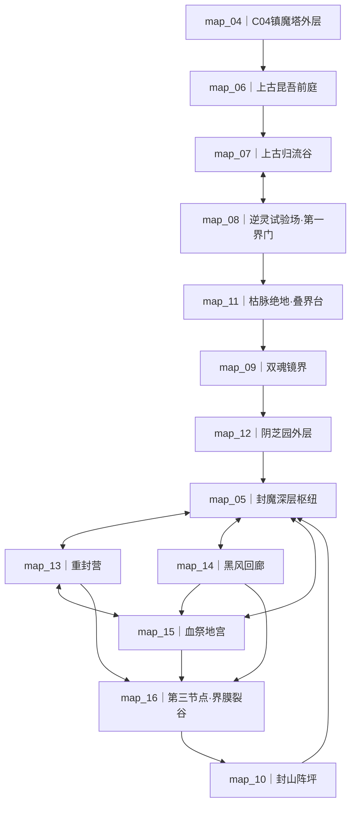

# 《昆吾禁地》完整游戏野外大地图与内容框架（草案）

版本：full-map-framework.6  
日期：2026-08-06  
文档域：完整游戏地图与关卡内容  
状态：基于 `story-baseline.1` 的第二版派生框架；已扩充为16张大地图，尚未冻结坐标、数值、掉落与制作排期  
上游总纲：[完整游戏剧情总纲](../剧情/24_完整游戏剧情总纲_草案.md)  
主线场景：[完整游戏主线详细剧情](../剧情/25_完整游戏主线详细剧情_草案.md)  
支线剧情：[完整游戏支线剧情库](../剧情/26_完整游戏支线剧情库_草案.md)  
1.0固定内容：[1.0版本完整策划案](../15_1.0版本完整策划案_草案.md)  
旧版迁移参考：[四图固定对象与经济清单](22_1.0四图固定对象与经济清单_草案.md)；与本框架及28–31冲突时以本目录新版地图文档为准  
前四图详细设计：[地图01](28_地图01_破禁山麓与万修之门_详细设计_草案.md)、
[地图02](29_地图02_白玉广场_详细设计_草案.md)、
[地图03](30_地图03_灵宝遗址_详细设计_草案.md)、
[地图04](31_地图04_镇魔塔外层_详细设计_草案.md)  
长期经济与阵容：[可重复资源副本、新修士追赶与Boss阵容克制](32_可重复资源副本与新修士追赶机制_草案.md)
Boss阶段馈赠：[乌婆Boss魂魄与魂器馈赠机制](../剧情/35_乌婆Boss魂魄与魂器馈赠机制_草案.md)
营地后勤与野外循环：[交易行、灵源院、百宝库、还魂殿、扎营失败与重访刷新](../数值/36_营地后勤与野外循环机制_草案.md)

> 本文先回答“完整游戏要走哪些大地图、每张图承担什么剧情和内容生态”，再为每张图预留
> NPC、普通敌群、精英、Boss、资源、事件和副本槽位。本文不是剧情事实源，不改写C01–C13
> 已确认场景，也不自动扩大当前1.0、PRD或Demo范围。

## 1. 文档边界与本轮结论

### 1.1 本轮先固定的框架

1. 完整游戏采用`16张稳定大地图＋营地＋结局演出实例`，其中C01–C04仍保持当前四图线性闭环；
2. `map_01`至`map_04`继续使用1.0既定内容，`map_05`继续保留为“封魔深层”而不改作其他地域；
3. 新增`map_06`至`map_16`，把上古地域、当世绝地、宗门战区与空间节点拆成足够承载35–45小时的完整区域；
4. C04以后采用地图网络，不按编号顺序推进。主线和支线可以串联两至三张地图，允许先进入新图取得
   阵器、坐标、证词或NPC协助，再返回旧图解决此前无法处理的封门、阵眼、Boss或副本；
5. 归流谷、逆灵试验场、现有四图和封魔深层通过“同地不同时态／战况”保留地貌对应，
   让玩家能够亲眼比较上古仙境、当世遗迹与终局战场；
6. 每张图都拥有完整内容卡，但不强制每个时态都设置Boss。Boss只用于章节收束或独特机制，
   调查图与议事图允许用精英、系统战或环境目标收束；
7. C13不新增可刷野外图。三种结局复用营地、昆吾旧址和未来镜头，兑现C12结果。
8. 每逢主线Boss里程碑第2、4、6……位首杀固定产出一枚乌婆魂魄；序位写入Boss内容表，
   C04后的非编号顺序和跨图任务不会改变掉落对象。

### 1.2 本轮不冻结的内容

- 新图最终尺寸、精确坐标、最短步数和补给消耗；
- 敌人数值、技能、掉落数量、刷新周期和Boss阶段参数；
- 候选敌人、精英与系统战的最终显示名；
- 支线总量十二条是否全部独立制作；
- 各地图正式逻辑ID是否直接采用本文候选编号，或拆成基础图与状态变体ID。

上述内容需在本框架确认后，依次进入固定对象清单、数值分册和PRD，不在本轮提前写死。

## 2. 地图层级与三种探索模式

### 2.1 大地图、局部副本与战斗实例

| 层级 | 作用 | 持久内容 | 不应承担的内容 |
|---|---|---|---|
| 大地图 | 完整二维区域、迷雾、固定坐标、补给压力和跨图关系 | 地形、NPC、敌群、资源、事件、副本入口、出口 | 不为一段对话或一次回忆单独建图 |
| 局部副本 | 大地图内1个主题明确的封闭区域 | 独立入口、少量房间、精英、剧情物、一次性宝箱 | 不复制另一张同规模野外图 |
| 战斗实例 | Boss、守阵、护送或多目标机制战 | 战前状态、阶段脚本、结算结果 | 不承担自由探索和普通采集 |
| 演出实例 | 旧日记忆、终局尾声、未来镜头 | 对话、镜头、选择和回看 | 不消耗普通入山补给，不伪装成可探索图 |

### 2.2 三种探索资源口径

| 模式 | 使用章节 | 主要压力 | 可带回内容 | 规则边界 |
|---|---|---|---|---|
| 当世肉身远征 | C01–C04、C07、C10、C12 | 灵粮、负重、伤亡、归营路线 | 实体材料、装备、任务物、证据 | 沿用现有`ExpeditionState`口径 |
| 上古命灯投影 | C05–C06、C11 | 命灯稳定、投影损伤、锚点撤离 | 阵式、姓名、证词、魂印、因果锚点 | 普通灵药、灵石、古宝不能跨时代带回 |
| 神魂／记忆探索 | C08–C09 | 记忆完整、证据保护、命灯牵引 | 时间戳、证词、魂印、契约状态 | 不设置常规采矿和普通战利品刷取 |

过去与记忆地图仍使用固定方格、迷雾、固定对象和四方向移动，但将“灵粮／负重”替换为对应的
局部压力。这样保留统一探索手感，也不违反普通物资不能跨时代的剧情规则。

## 3. C01–C13全流程地图网络

| 章节 | 时态 | 主要大地图 | 章节地图目标 | 章节出口／汇流 |
|---|---|---|---|---|
| P0 | 现在 | 山外联营 | 接掌总印、恢复生产、组成四人队 | 解锁`map_01` |
| C01 | 现在 | `map_01`破禁山麓·万修之门 | 修阵灯、救顾南炉、取得双令与阵录十三 | 守门石灵后进`map_02` |
| C02 | 现在 | `map_02`白玉广场 | 四阵眼、木青萝、叶承安、尸窟与筑基 | 封坛尸将后进`map_03` |
| C03 | 现在 | `map_03`灵宝遗址 | 三殿、元牌、五鬼袋、铸灵堂与塔门令 | 四臂铸灵傀后进`map_04` |
| C04 | 现在 | `map_04`镇魔塔外层 | 三封链、结丹、身份揭示、叶观衡血祭 | 残翅战后触发第一次穿越 |
| C05 | 过去一 | `map_06`上古前庭→`map_07`归流谷↔`map_08`逆灵试验场 | 见证上古盛景；跨图完成救人／保图／留样 | 两图目标汇流后触发归流谷守战 |
| C06 | 过去一 | `map_08`第一界门↔`map_07`归流谷；条件回访`map_06` | 南路伤者、东路副盘、西路断后；补取地脉与阵籍工具 | 第一界门闭合后回到当世 |
| C07 | 现在 | `map_01`／`map_02`生痕回访→`map_08`遗址态↔`map_11`枯脉绝地 | 跨图核对九还遗阵、裴玄度三录、旧队勘记与排错坐标 | 互相补齐坐标后稳定第二节点 |
| C08 | 过去二／记忆 | `map_09`双魂镜界 | 雪玲、珑梦、阵法三层互证并取得第三魂印 | 记忆空间崩塌 |
| C09 | 过去二／记忆 | `map_09`双魂镜界·闭锁态 | 借名契约或高难无名归途 | 五道神念返回当世 |
| C10 | 现在 | `map_03`／`map_04`战况态→`map_12`阴芝园→`map_05`深层枢纽；再自由处理`map_13`～`map_16` | 恢复《寻界归流》、万修三路、借身、黑风坐标与第三节点 | 达到最低汇流条件后固定封山时间坐标 |
| C11 | 过去三 | `map_16`第三节点→`map_10`封山阵坪 | 北道真相、眠棺第十四息、拆契、阵心三项工作 | 留下最后阵外批注并返回当世 |
| C12 | 现在 | `map_05`废阵井枢纽↔`map_13`～`map_16`终局态 | 撤离、补齐阵位／锚点、众生同阵或第三契 | 返回`map_05`执行路线专属终战 |
| C13 | 现在／未来 | 营地、昆吾旧址与结局演出实例 | 人物尾声、世界结果、未来韩立镜头 | 通关与因果索引 |



`map_05`的编号早于新增上古地图，是因为1.0已经把它作为“封魔深层”稳定预告。地图编号只用于
存档与内容管理，不代表玩家必然按编号顺序首次进入。

地图箭头只表示首次发现关系，不表示单向关卡。C04以后除剧情明确封闭的投影或记忆段落外，已开启出口
允许回访；任务页应显示“当前可处理对象”和“仍缺少的跨图来源”，而不是只显示下一个地图编号。

## 4. 十六张大地图总览

| ID | 显示名 | 时态／状态 | 框架边界建议 | 地形骨架 | 核心职责 |
|---|---|---|---:|---|---|
| `map_01` | 破禁山麓·万修之门 | 当世初探／C07生痕 | 已冻结`48×64` | 狭长山谷、废营、暗道、残门 | 教学、阵录十三、第一处上古生痕 |
| `map_02` | 白玉广场 | 当世初探／C07生痕 | 已冻结`64×64` | 八边形广场、四庭院、外环玉道 | 阵眼、阵营冲突、未竟阵遗址入口 |
| `map_03` | 灵宝遗址 | 当世初探／C10战况 | 已冻结`56×72` | 三座岛状建筑区、斜山脊、机关廊 | 夺宝与支线汇流、阴芝园外层入口 |
| `map_04` | 镇魔塔外层 | 当世初探／C10战况 | 已冻结`72×64` | 破碎环带、三封链长臂、塔壁深坑 | 1.0终战、双魂伏笔、黑风坐标前线 |
| `map_05` | 封魔深层·废阵井 | C10枢纽／C12终局 | 候选`72×80` | 环形深层枢纽、中央废阵井、五向封门 | 跨图汇流、众生议事与三路线终战 |
| `map_06` | 上古昆吾前庭 | 过去一 | 候选`64×72` | 完整万修门、白玉市集、议阵台、地脉门 | 建立“山未成牢”的第一视觉记忆 |
| `map_07` | 上古归流谷 | 过去一 | 候选`64×72` | 三脉光河、灵药坡、观星台、地脉门 | 灵脉盛景、髓样与归流谷守战 |
| `map_08` | 逆灵试验场·第一界门 | 上古守界／当世遗址 | 候选`72×72` | 中央界门、三条撤守翼、偏阵夹层 | 逆阵技术链、十三伤者、第一界门终战 |
| `map_09` | 双魂镜界 | 三记忆层／闭锁态 | 候选`64×64×3层` | 同坐标三层走廊、镜室、无名返回环 | 双魂互证、第三魂印与借名契约 |
| `map_10` | 封山阵坪 | 过去三 | 候选`72×64` | 十二核心阵位、三支路、阵心内层 | 北道真相、阵心结果、最后阵外批注 |
| `map_11` | 枯脉绝地·叠界台 | C07当世 | 候选`72×72` | 枯河床、晶化药坡、破碎观星台、叠界台 | 裴玄度三录、旧队勘记与第二节点 |
| `map_12` | 阴芝园外层 | C10当世 | 候选`64×72` | 阴湿药园、空间禁制、孢林与封药洞 | 韩立情报交换、黑风折返规律、深层入口 |
| `map_13` | 万修战场·重封营 | C10／C12战况 | 候选`72×64` | 撤离营、断阵壕、伤员区、重封阵台 | 救援木青萝、叶承安、阵师与低阶修士 |
| `map_14` | 黑风回廊 | C10／C12战况 | 候选`64×80` | 多重折返廊、旗影井、坐标镜面、风眼台 | 取得、封存、持有或交出黑风坐标 |
| `map_15` | 叶家血祭地宫 | C10／C12战况 | 候选`72×64` | 族印甬道、祭脉池、双令门、血祭主阵 | 叶家双令、最后阵印、赎罪或裂界锚点 |
| `map_16` | 第三节点·界膜裂谷 | C10／C12当世；C11入口 | 候选`64×80` | 错位山体、界膜断层、时间锚台、节点核心 | 固定封山时间坐标、连接过去与终局界膜 |

### 4.1 C04后的地图网络规则

1. **编号不是难度阶梯**：`map_12`可以早于`map_05`首次进入，`map_11`也可以在`map_08`遗址态
   尚未彻底完成时开启；地图选择页按章节、时态和任务状态分组，不按编号强制排序。
2. **首次发现不等于完成**：玩家可以先踏入新图，取得一项关键阵器或证词，再回旧图开启此前锁住的
   资源井、封门、副本深层或Boss弱化机制。
3. **一条任务默认跨两至三图**：单图内完成的内容用于地图教学或即时事件；世界支线、个人支线和
   高阶结局准备原则上至少产生一次跨图往返。
4. **不设置无提示钥匙墙**：旧图对象必须提前显示“缺少何类线索”，发现来源地图后再显示具体名称；
   玩家不需要盲扫已经清过的整张地图。
5. **回访产生新状态，不只开一扇门**：带回关键物后，旧图至少同时变化NPC对白、敌群、环境、
   一个可处理对象和一项延迟反馈。
6. **所有高级路线仍可降级**：跨图关键对象丢失、NPC拒绝或副本失败时，常规主线始终可完成；
   关闭的是具体救世／灭世方案，不是整个存档。

### 4.2 首轮跨图钥匙设计

| 取得位置 | 关键对象 | 返回位置 | 解决的问题 | 后续再开启 |
|---|---|---|---|---|
| `map_08`东路逆阵副盘 | 界潮分离针 | `map_07`第三灵脉井 | 安全取出纯净髓样；没有时只能污染取样或放弃 | 样本回到`map_08`校正逆阵母图 |
| `map_07`地脉门 | 归流地脉印 | `map_08`西路断后阵台 | 让多人分担闭锁反震，避免默认牺牲一名阵卫 | 卫殊结果改变C11与石岩个人线 |
| `map_11`《测界篇》排错坐标 | 玄度排错序列 | `map_08`当世遗址深层 | 打开被错误坐标覆盖的九还末室 | 取得第二节点潮汐钥后回`map_11`叠界台 |
| `map_08`九还末室 | 第二节点潮汐钥 | `map_11`叠界台 | 拆除最后一个错误坐标并进入《开门篇》Boss区 | 稳定`map_09`入口 |
| `map_12`阴芝园 | 黑风折返规律 | `map_14`旗影井 | 预判三次旗影折返，取得完整坐标而非只毁旗影 | 坐标可封存到`map_05`或用于`map_16` |
| `map_14`坐标镜面 | 血影同源坐标 | `map_15`双令门 | 揭露血祭阵真正主阵位置，绕过叶家伪门 | 取得最后阵印后回`map_13`开救援走廊 |
| `map_15`最后阵印 | 重封营通行权 | `map_13`断阵壕 | 打开被夺宝派锁死的第二撤离线 | 幸存阵师帮助`map_16`稳定第三节点 |
| `map_13`多人阵位校准 | 四灯定位式 | `map_16`时间锚台 | 让四人投影同时固定封山之日，不牺牲单一命灯 | 取得节点回声后回`map_05`定位废阵井阵心 |
| `map_16`节点回声 | 未来阵心定位 | `map_05`中央废阵井 | 区分普通废石与C11留下的逆转／魔染阵心 | 开启C12终局准备 |

这些钥匙不是普通背包消耗品，而是任务阵器、坐标、阵权或知识记录。取得后不会因全队阵亡丢失，
也不能在商店购买替代。

## 5. 地图内容卡

本节中的新增敌名与首领名均为候选。上游剧情已明确的名称直接沿用；没有明确命名的系统战标记为
“机制首领”，后续可以保留为战斗标题而不强行创造一个高阶实体。

### 5.1 `map_01` 破禁山麓·万修之门

| 内容 | 框架 |
|---|---|
| 主要NPC | 岑守一远程传讯、顾南炉、叶观衡远程传讯；叶家先遣死者与乌婆解锁线索；C07由木青萝／叶承安按知情范围参与生痕互证 |
| 常见小怪 | 噬灵鼠、碎岩灵、游荡尸兵、残阵灵光、石甲守卫 |
| 精英 | 裂甲石卫、尸煞执旗者 |
| Boss | 守门石灵；C07回访不新增Boss |
| 资源点 | 灵木、玄铁、灵粮、低阶灵晶；C07新增一次性风化拓片与总印裂纹证据，不刷新为普通资源 |
| 关键事件 | 三盏阵灯、两份开山令、废营粮册、万修之门残碑、第一处历史生痕 |
| 局部副本 | 山腹暗道（顾南炉救援）；C07残碑背面为开放事件，不复制副本 |
| 长线回声 | C05上古批注决定C07残碑形态；切下碑面会损害阵外批注执行权，原地封存则保留锚点 |

### 5.2 `map_02` 白玉广场

| 内容 | 框架 |
|---|---|
| 主要NPC | 叶观衡、木青萝、叶承安、银月回声；C07旧史议事后可由盟友回访未竟阵遗址 |
| 常见小怪 | 白玉尸兵、缠魂藤、木魅幼体、阵纹灵蛇、残禁法影 |
| 精英 | 复生尸卫、噬法木魅、四象阵灵 |
| Boss | 封坛尸将；C07遗址态不新增Boss |
| 资源点 | 灵木、玄铁、灵晶、凝露草；C07增加废炉阵纹、魔标样本和阵图载体三类一次性对象 |
| 关键事件 | 叶观衡解释、木青萝救援、四象阵眼、叶承安尸窟、公开质问、第二处历史生痕 |
| 局部副本 | 木魅庭院、封尸地窟；C07从废炉入口连接`map_08`当世遗址态 |
| 长线回声 | C06试验场保留／毁去／移入夹层，决定C07这里出现九还密室、空墙、未解残阵或魔标陷阱 |

### 5.3 `map_03` 灵宝遗址

| 内容 | 框架 |
|---|---|
| 主要NPC | 叶观衡、木青萝、韩枭、圭灵残念；C10战况态只保留战场先遣、入口证据与通向阴芝园的追踪线，韩立正式情报交换移至`map_12` |
| 常见小怪 | 断刃器灵、铸灵铜傀、夺宝散修、阴罗宗鬼卒、吞金兽；C10加入被高阶余波驱动的残器与魔标夺宝者 |
| 精英 | 灵宝阁守卫、阴罗宗长老分魂、失控剑灵、熔炉石傀；C10旧精英按存档状态变成尸骸、盟友或战场阻碍 |
| Boss | 四臂铸灵傀；C10不再复活该Boss |
| 资源点 | 玄铁、灵晶、庚精、凝丹灵草、器灵残片；C10战况态以救援物资、封印墨和古宝残片为主 |
| 关键事件 | 三条首选路线、真假灵宝、本命元牌、五鬼伏击、叶家抽灵影；C10新增阴芝马痕迹与高阶修士通过记录 |
| 局部副本 | 灵宝阁残层、铸灵堂地宫；C10在阴芝马痕迹处开放通往`map_12`的跨图出口 |
| 1.0重复模式 | “铸灵堂·回火矿窟”低阶灵石本；首清后主动重返，不复活四臂铸灵傀，不参与主线完成条件 |
| 长线回声 | 元牌、五鬼、封印图和叶家双令在这里取得基础形态，C10再转为自愿盟友、封存物或裂界锚点 |

### 5.4 `map_04` 镇魔塔外层

| 内容 | 框架 |
|---|---|
| 主要NPC | 叶承安、叶观衡、木青萝、银月／珑梦回声、血焰伪影；C10战况态出现重封派、伤员与黑风坐标记录者 |
| 常见小怪 | 银甲尸、封链魔灵、摄魂残影、魔化石兽、裂隙化形 |
| 精英 | 金身尸卫、黑风旗影、魔气寄生体、镇塔狱卒、银翅残羽 |
| Boss | 银翅夜叉·尸煞化身；C10不与本体或高阶人物正面复战 |
| 资源点 | 庚精、魔髓碎屑、凝丹灵草、古宝残片、灵晶；C10战况态减少普通采集，增加封链残能与黑风沙痕 |
| 关键事件 | 三处封链、双魂争语、第十三个名字、四人结丹、叶观衡血祭、黑风坐标前置 |
| 局部副本 | 侧狱、封魂间；C10封魂间升级为双魂证词在当世的互证点 |
| 1.0重复模式 | “封魂间·镇魂残响”低阶魂晶本；只复演阵法投影，不反复炼化剧情亡魂，不参与主线完成条件 |
| 长线回声 | C04修复／抽取三链直接改变C10、C12撤离难度、灵脉活性和灭世锚点来源 |

### 5.5 `map_05` 封魔深层·废阵井

| 内容 | 框架 |
|---|---|
| 主要NPC | 岑守一传念、木青萝／替代持图者、圭灵／替代托山者、五鬼残魂、玲珑／双魂回声、元刹；`map_13`至`map_15`存活或被带回的人物按结果进入议事环 |
| 常见小怪 | 断链魔灵、废阵井裂界孽物、镇塔尸傀、阵心寄生影、被跨图锚点引来的条件敌群 |
| 精英 | 废井守阵傀、阵心辨伪影、裂界锚点合生体；五鬼被炼化时追加界魂钉守卫 |
| Boss | 一个“终局阵法Boss”配置，先共用“四链离位”开场，再按重新封链／逆转灵魔大阵／举界入魔切换三套阶段脚本；不把韩立、玲珑或元刹魔界本体作为可击杀Boss |
| 资源点 | C10一期：封印墨、古宝残片、阵力结晶与一次性阵心辨识点；C12二期停用普通采集，只保留救援补给、阵位修复和证据回收 |
| 关键事件 | 深层首次议事、不能亲自上阵、魔躯试用、借身、跨图任务分配；C12万修争命汇流、留下的不是资源、众生议事、众生落名、第三契与方案确认 |
| 局部副本 | 中央废阵井、断名仪式室、剥身魂印战、魔染阵井；重封营、黑风回廊和血祭阵已经拆为`map_13`至`map_15` |
| 长线回声 | 所有世界支线的活人、残魂、阵图和祭品在废阵井前实体化结算；同一个对象不能同时作为自愿盟友和裂界资源 |

终局Boss不是“把元刹血条打空”：常规路线牵回四链；救世路线完成四眼同步、排魂、三处剥离、
反转坐标和放下总印；灭世路线保护裂界锚点、连接魔染阵心并完成写界。

### 5.6 `map_06` 上古昆吾前庭

| 内容 | 框架 |
|---|---|
| 主要NPC | 商九还、卫殊、上古巡阵修士、昆吾三老议阵投影、玲珑公开传讯；山中异类与阵师使用群体NPC，不为每名路人建立长线角色 |
| 常见小怪 | 越界灵虫、魔气附着灵兽、失序阵纹、裂界幼兽、被污染的守门傀；保留少量正常野兽对照，不让上古地图开场全是魔物 |
| 精英 | 魔标巡阵傀、裂隙猎兽 |
| Boss | 无。地图由“阵中无名”和“三老争界”收束，避免刚进入上古就用Boss取代世界建立 |
| 资源点 | 凝露草、上古灵木、白玉髓、灵脉露、稳定界潮记录；均转换为临时补给或总印记录，不能原物带回 |
| 关键事件 | 白玉无尘、万修之门核名、第一次阵外批注、山契核对、灵脉如河、三老争界 |
| 局部副本 | 万修门边阵廊、地脉门养护区；以观察、检定和小规模守阵为主 |
| 长线回声 | 玩家必须记住完整门、活跃市集和共同山契，才能在C07识别当世遗迹不是自然老化 |

### 5.7 `map_07` 上古归流谷

| 内容 | 框架 |
|---|---|
| 主要NPC | 商九还、归流谷阵师与药师、圭灵上古远影；卫殊在取得地脉印后短暂来此核对断后台 |
| 常见小怪 | 污染灵兽、逆流魔藤、裂界幼兽、坐标寄生体、失控地脉傀 |
| 精英 | 魔标灵兽、归流节点吞噬者、第三灵脉井守卫 |
| Boss | 裂界魇兽 |
| 资源点 | 灵脉髓样、高阶灵药、界潮晶、归流露；普通资源只作投影内补给，髓样和地脉印进入因果记录 |
| 关键事件 | 灵药坡、观星台、地脉门、三选二分配、元刹捷径、归流谷守战 |
| 局部副本 | 三口灵脉井、山契旧洞、归流节点内层 |
| 跨图往返 | 第三灵脉井初见时无法安全取样；需先去`map_08`取得界潮分离针。地脉门取得的归流地脉印反过来用于`map_08`西路断后阵台 |

当世同一地域拆为`map_11`，两图共享河床、坡面、观星台与地脉门的空间关系。拆成两个稳定地图ID是为了
让两种时态各自拥有完整敌群、资源、迷雾和回访进度，而不是取消同地对照。

### 5.8 `map_08` 逆灵试验场·第一界门

| 内容 | 上古守界态（C05–C06） | 当世遗址态（C07） |
|---|---|---|
| 主要NPC | 商九还、卫殊、十三名伤者代表、昆吾三老、上古阵卫与阵师 | 陆清、木青萝、墨言作为解读者；商九还传承／最后神念；乌婆与伤者回声按支线条件出现 |
| 常见小怪 | 魔军先遣影、界门噬灵体、污染阵灵、折返魔影 | 残阵灵光、魔标回声、夹层噬魂体、失控试验傀 |
| 精英 | 界门撕裂者、魔标聚魂体、断后阵台噬魂影 | 魔标陷阱核心、失控九还阵傀 |
| Boss | 界门魔先锋·无相罗刹的未完全投影；高阶主体由三老与玲珑处理，玩家只完成侧翼三目标 | 不新增Boss；危险来自读取残阵和后世魔标战 |
| 资源点 | 逆阵母图、纯净髓样、潮汐记录、阵器零件、临时疗伤台 | 阵纹载体、魔气样本、废阵铜、后世魂印方向；核心证据均一次性 |
| 关键事件 | 未竟逆阵、救人／保图／留样、卫殊是否自愿、十三伤者、两种灵气、试验场处置、第一界门十二响 | 九还密室四形态、十三人回声、穿越知情范围、第一界门坐标残差 |
| 局部副本 | 南路救治台、东路逆阵副盘、西路断后阵台 | 传承密室／未解残阵／空墙夹层／魔标陷阱四选一状态副本 |
| 跨图往返 | 东路取得界潮分离针后回`map_07`取髓样；取得归流地脉印后再回西路处理断后 | 需先从`map_11`取得玄度排错序列打开九还末室；末室中的潮汐钥再带回`map_11`完成叠界台 |

三条撤守翼必须全部进入，顺序只改变时间、敌人和保留对象。这样保留C06的三路压力，避免路线选择
把一整条剧情永久跳过。

### 5.9 `map_09` 双魂镜界

| 内容 | 框架 |
|---|---|
| 主要NPC | 雪玲、珑梦、元刹；石岩与白灵进入雪玲层，陆清与墨言进入珑梦／阵法层，四人最终汇流 |
| 常见小怪 | 伪忆残影、封魂钉孽物、镜室守卫、无时间戳影、无名阵风 |
| 精英 | 雪玲层“封魂执行影”、珑梦层“求援截获影”、阵法层“第三魂印追迹”、记忆崩塌时的夺舍裂像 |
| Boss | 无名魂狱；C08“保护身体而不是替身体选主人”按章节机制精英处理，不改变夺舍既定史实 |
| 资源点 | 不设置常规矿草。固定对象为时间戳、封魂钉痕、求援阵式、伪记忆断口、本征魂印和命灯稳定节点 |
| 关键事件 | 三门调查顺序、雪玲隐瞒、珑梦隐瞒、阵法无动机记录、元刹真实记忆、第三道魂印、借名全文与承载选择 |
| 局部副本 | 三层本身就是同坐标叠层，不再套娃新增普通副本；闭锁态开启“五灯归途”战斗环 |
| 长期重复模式 | 主线与借名结算后把既有“五灯归途”复用为高阶魂晶残响模式；不新建第四层或套娃副本，不重置真实人物选择 |
| 长线回声 | 证词完整度、魂印质量和借名承载直接改变C10玲珑配合、C11阵心纯化与C12排魂难度 |

三层使用相同坐标骨架和不同可见事实。玩家在一层移动、开门或破坏对象后，另两层显示对应缺口，
形成“同一现场、三种叙述”，而不是三张互不关联的线性走廊。

### 5.10 `map_10` 封山阵坪

| 内容 | 框架 |
|---|---|
| 主要NPC | 昆吾三老、玲珑残余神念、商九还／遗留阵录、卫殊／继任阵卫、十三伤者回声、元刹；岑守一通过跨时代传念出现 |
| 常见小怪 | 上古魔军先遣、主封反震灵、错籍阵影、界面坐标寄生体、阵心破坏傀 |
| 精英 | 魂印吞噬者、主封执行傀、魔染阵心护影、无署名阵令追迹 |
| Boss | “封山终阵”机制首领：保住载体、写准魂印、限定未来权限三目标并行；不创造高于剧情层级的新魔界本体 |
| 资源点 | 不设置可重复采集。只放阵心材料、纯净样本校验点、古阵墨、魂印石板与临时命灯恢复节点 |
| 关键事件 | 没有来客名册、过去保存之物作证、三老的正确与错误、北道四份外证、可选主观记忆、眠棺第十四息、关系命名、断名剥身、阵心三结果、最后批注 |
| 局部副本 | 北道记录层、眠棺重叠夹层、断名仪式室／剥身魂印战；均由条件开启 |
| 长线回声 | C05–C10保存的每名NPC、证据、阵器与魔标都在阵坪上以实体状态出现，决定纯化、破碎或魔染，而不是换算成隐藏分数 |

本图存在封山倒计时，但倒计时按“完成目标后推进阵息”的剧情节拍结算，不使用现实时间催促玩家阅读创伤内容。

### 5.11 `map_11` 枯脉绝地·叠界台

| 内容 | 框架 |
|---|---|
| 主要NPC | 裴玄度早期留影、偏执期神念、最后残念；十二年前旧队勘记；条件保留的十三伤者后裔／残魂；陆清、白灵与墨言分别承担阵理、伤势与证词解读 |
| 常见小怪 | 晶化灵兽残壳、时间错位影、空间风化形、错误坐标残像、枯脉寄生体 |
| 精英 | 晶化求渡者、错位修士回响、叠界守痕 |
| Boss | 破界执念（裴玄度最后神念、空间风与失败坐标的纠缠体，不是其生前本体） |
| 资源点 | 枯脉晶、破碎观星玉、空间尘、纯净样本高难替代点；强采可能使经脉晶化并损坏证据 |
| 关键事件 | 四组上古／当世地标对照、《测界篇》《问天篇》《开门篇》、旧营勘记、元刹归还记忆、第二节点定位 |
| 局部副本 | 破碎观星台、裴玄度废弃洞府、叠界台 |
| 跨图往返 | 《测界篇》给出排错序列后回`map_08`开启九还末室；取得潮汐钥再回叠界台，才能进入《开门篇》Boss区并稳定`map_09` |

本图与`map_07`使用同一套地标坐标映射，但拥有独立地图ID、迷雾和对象状态。玩家在地图选择页可并列查看
“上古记录”和“当世勘测”，方便理解同地变化。

### 5.12 `map_12` 阴芝园外层

| 内容 | 框架 |
|---|---|
| 主要NPC | 韩立、银月短暂回应、受困采药修士、药园旧守阵回声；阴芝马只作为稀有灵物痕迹和韩立目标，不成为普通掉落 |
| 常见小怪 | 噬灵菌群、腐根药傀、孢雾尸兵、禁制灵蛇、逐药散修 |
| 精英 | 噬魂芝母、错位守药傀、阴罗夺药使 |
| Boss | 无独立主线Boss。韩立已拆过一部分高阶禁制，本图以情报交换和多方竞速收束，不让玩家抢走其原作层级目标 |
| 资源点 | 阴湿灵土、药露、护魂菌丝、空间苔、少量结婴准备药材；阴芝马本体不可采集 |
| 关键事件 | 韩立只换情报、银月互证、被拆过的空间禁制、黑风旗一次折返记录、魂印分藏建议 |
| 局部副本 | 封药洞、孢林迷阵、银月镜龛 |
| 跨图往返 | 取得黑风折返规律后开启`map_14`安全窗口；从`map_14`带回完整坐标可再开药园深层封匣，取得一件不绑定结局的阵位强化物 |

### 5.13 `map_13` 万修战场·重封营

| 内容 | 框架 |
|---|---|
| 主要NPC | 木青萝、叶承安、叶家重封派阵师、各宗低阶伤员、白灵救治队；叶观衡按存活与赎罪条件远程或本人出现 |
| 常见小怪 | 魔标伤员化形、夺宝散修、血祭追兵、崩阵尸傀、黑风落影 |
| 精英 | 灭口执令使、崩阵魔标体、被抽灵的重封阵卫 |
| Boss | “断阵壕崩溃”机制首领：在敌潮中依次稳定伤员区、阵师区和撤离线；不以击杀某名伤员或宗门人物作为胜利条件 |
| 资源点 | 救援药材、封印砂、阵旗、伤员灵力债、遗失储物袋；抽取伤员灵力属于高代价资源选项 |
| 关键事件 | 救全部／只救关键阵师／抽灵加固、木青萝与叶承安去留、证人保护、重封派交印前置 |
| 局部副本 | 断阵壕、伤员营、被夺宝派锁死的第二撤离线 |
| 长期重复模式 | 第二撤离线稳定后开放“断阵壕·战场回收”高阶灵石模式；守运输阵、分区回收阵资并击退夺宝者，不重置伤员生死 |
| 跨图往返 | 初次只能稳住第一撤离线；需到`map_14`找到血影同源坐标、进入`map_15`取得最后阵印，再回来开启第二线。幸存阵师随后提供`map_16`所需四灯定位式 |

### 5.14 `map_14` 黑风回廊

| 内容 | 框架 |
|---|---|
| 主要NPC | 陆清、墨言、韩立提供的一次情报窗口、被折返困住的修士回声、元刹低语；其他高阶人物只以旗影外的战场动静出现 |
| 常见小怪 | 黑风影卒、折返残像、坐标噬灵体、镜面魔虫、被旗影替换的阵傀 |
| 精英 | 黑风折界使、三相旗影、坐标吞噬者、魔标追踪体 |
| Boss | 黑风旗·三重折影；玩家击破的是当世侧翼投影并取得坐标控制，不宣称毁掉黑风旗本体 |
| 资源点 | 黑风沙、定界晶、坐标镜片、界潮残能、魔气样本；完整坐标是唯一任务对象 |
| 关键事件 | 三次折返预判、封存／持有／交元刹、墨言记录声音、魔躯捷径、血影同源坐标 |
| 局部副本 | 旗影井、坐标镜廊、风眼台 |
| 跨图往返 | `map_12`情报降低旗影战难度；取得血影同源坐标后开启`map_15`真实主阵。C12若坐标曾交元刹，需回本图完成额外夺回战才能走救世 |

### 5.15 `map_15` 叶家血祭地宫

| 内容 | 框架 |
|---|---|
| 主要NPC | 叶观衡、叶承安、叶家重封派与夺宝派残部、血祭受害者回声、墨言；叶月圣与血焰只保留高阶痕迹和伪影，不进入低层Boss战 |
| 常见小怪 | 血祭残兵、族印尸卫、抽灵影、血脉阵傀、灭口修士 |
| 精英 | 双令执法傀、祭脉吞灵体、叶家夺宝监阵使 |
| Boss | 叶家血祭主阵；胜利条件按玩家选择变为停止、封存或强化阵法，不以“杀死所有叶家人”为唯一解 |
| 资源点 | 族印玉、血阵砂、封印墨、抽取阵力、祭脉结晶；来自活人的阵力必须明确标注来源与后果 |
| 关键事件 | 两道命令同真、公开罪证、叶观衡赎罪／悔悟未偿／继续血祭、最后阵印、裂界锚点确认 |
| 局部副本 | 双令档库、祭脉池、血焰伪门、血祭主阵 |
| 跨图往返 | `map_14`坐标揭露真正主阵；最后阵印带回`map_13`开启第二撤离线。若选择保留血祭阵，C12需回本图完成强化或摧毁的最终确认 |

### 5.16 `map_16` 第三节点·界膜裂谷

| 内容 | 框架 |
|---|---|
| 主要NPC | 四名固定修士、玲珑魂印短时投影、元刹、重封营幸存阵师；韩立只在界膜外提供一次高阶牵制窗口 |
| 常见小怪 | 界膜裂片、时序错影、黑风坐标寄生体、无年阵灵、魔军残像 |
| 精英 | 时间锚吞噬者、错代守门傀、第三节点裂界体 |
| Boss | “第三节点稳定战”机制首领：同时保护魂印、刮除黑风坐标并固定封山之日；不把穿越入口做成单纯伤害竞速 |
| 资源点 | 界膜碎片、时序晶、阵外墨、命灯恢复点、节点回声；均为一次性任务或本次行动资源 |
| 关键事件 | 第三节点判断、四灯定位、魂印交付、封山日期确认、进入C11；C12回访时用于反转或承认界膜坐标 |
| 局部副本 | 时间锚台、错代山腹、界膜内层 |
| 跨图往返 | 需要`map_13`四灯定位式和`map_14`黑风坐标状态才能取得最佳结果；节点回声带回`map_05`定位阵心。C12救世与灭世都要回本图完成一次界膜操作，但目标相反 |

## 6. 新地图首轮内容量预算

以下数量用于判断地图是否过空或过量，只是框架预算。敌群数指固定编成，不等于新美术模板数；同地图的
不同时态可以复用骨架，但必须改变机制、环境作用和叙事身份，不能只换色。

| 地图 | 固定普通敌群 | 精英配置 | Boss／机制首领 | 资源／证据点 | 关键事件 | 局部副本 |
|---|---:|---:|---:|---:|---:|---:|
| `map_05`封魔深层 | C10为8–10；C12条件化8–12 | 3–4 | 1个终局Boss、3套路线脚本 | C10为6–8；C12为3–5 | 10–12 | 3–4 |
| `map_06`上古前庭 | 8–10 | 2 | 0 | 10–12 | 6–8 | 2 |
| `map_07`上古归流谷 | 10–12 | 3 | 1 | 8–10 | 6–8 | 3 |
| `map_08`第一界门 | 上古12–16；当世4–6 | 上古3；当世2 | 上古1；当世0 | 每时态8–10 | 共10–12 | 3翼＋1状态副本 |
| `map_09`双魂镜界 | 三层合计10–14 | 4 | 1 | 12–15个证据点 | 8–10 | 三叠层，不另增普通副本 |
| `map_10`封山阵坪 | 8–12 | 4 | 1个机制首领 | 4–6 | 10–12 | 3 |
| `map_11`枯脉绝地 | 12–14 | 3 | 1 | 10–12 | 8–10 | 3 |
| `map_12`阴芝园 | 10–12 | 3 | 0 | 10–12 | 6–8 | 3 |
| `map_13`重封营 | 12–14 | 3 | 1个机制首领 | 8–10 | 8–10 | 3 |
| `map_14`黑风回廊 | 12–14 | 4 | 1 | 8–10 | 7–9 | 3 |
| `map_15`血祭地宫 | 12–14 | 3 | 1个阵法Boss | 8–10 | 8–10 | 4 |
| `map_16`界膜裂谷 | 10–12 | 3 | 1个机制首领 | 6–8 | 7–9 | 3 |

`map_05`至`map_16`整体优先控制在约`32–40`个可复用普通敌人模板、`24–30`个独立精英机制和
`9–10`个章节级Boss／机制首领之内。固定敌群数量明显高于模板数量，同族通过武器、编成、环境机制和
时态状态复用；终局三路线共享基础场景、阵位和敌人骨架，只替换目标、阶段和世界反馈。

## 7. 跨地图延迟反馈矩阵

| 早期选择／对象 | 当下地图反馈 | 后续地图变化 | 终局用途 |
|---|---|---|---|
| 商九还存活／死亡 | `map_07`少保一项或保住传承者 | `map_08`当世出现可读密室或高难残阵；`map_10`由本人／阵录作证 | 降低逆阵补图与灵魔逆算成本 |
| 逆阵母图保留／炼器／魔染 | C05–C06战斗更难／成长更快 | C07出现完整载体、残式或魔标陷阱 | 纯化阵心、常规研究或灭世坐标 |
| 纯净髓样保留／污染 | `map_07`少保一项或接受元刹捷径 | `map_11`可跳过枯脉高难取样，或必须回`map_08`额外净化 | 区分人界灵气与魔界坐标 |
| 卫殊自愿／被命令／获救／魔标 | 西路关闭方式与伤亡变化 | 石岩个人线对“谁来承阵”的判断改变 | 自愿盟约范例或裂界锚点候选 |
| 十三伤者净化／保留／除籍／魔标 | `map_08`护送难度与即时安全变化 | `map_08`遗址态与`map_11`分别出现空名牌、后裔、残魂或魔标战 | C08魂印路径、白灵阵位或裂界祭品 |
| 万修门批注保存／切除 | 证物安全与公开力度变化 | C07第一处生痕是否仍是完整锚点 | 阵外批注执行权 |
| 双魂证词完整／单边／冲突 | C08战斗与记忆保护难度变化 | C10玲珑主动配合程度变化 | 救世排魂与元刹剥离 |
| 元牌归还／封存／驱使 | 石灵敌群、地图增益与风险变化 | C10圭灵谈判与地脉路线变化 | 自愿托山或裂界锚点 |
| 五鬼净化／封存／炼化 | 力量与遗愿完成度取舍 | C10给出封链顺序、部分证词或无声界魂钉 | 救世顺序或灭世锚点 |
| 叶家双令与血祭处理 | `map_13`救援与`map_15`阵权、伤亡变化 | `map_05`出现重封盟友、阵令遗物或持续血祭锚点 | 当世阵权、低伤亡常规或裂界锚点 |
| 黑风坐标封存／持有／交元刹 | `map_14`难度与主动权变化 | `map_10`决定阵心可反转或魔染；`map_16`与`map_05`决定旗影先手 | 救世反写坐标或灭世开界 |

### 7.1 主要任务的跨图骨架

| 任务链 | 地图串联 | 第一次回访 | 第二次回访／汇流 |
|---|---|---|---|
| 逆灵者的未竟阵 | `map_06`听见争议→`map_07`找样本→`map_08`找母图与分离针 | 带分离针回`map_07`取纯净髓样 | 带样本回`map_08`完成校正，C11在`map_10`决定阵心 |
| 岑守一旧阵簿／人界出路 | `map_01`残碑→`map_08`遗址→`map_11`裴玄度三录 | 带排错序列回`map_08`开九还末室 | 带潮汐钥回`map_11`完成叠界台，C10在营地恢复任务原文 |
| 化仙宗遗命 | `map_02`半图→`map_03`三老碑→`map_08`原始逆阵 | C10带宗门回应回`map_13`找木青萝 | C11在`map_10`见证原始用途，C12回`map_05`由持图者落名 |
| 失主的本命元牌 | `map_03`取得元牌→`map_07`见原始山契→`map_11`观察枯竭地脉 | 回`map_03`处理当世元牌归属与圭灵敌意 | C10／C12在`map_13`、`map_05`谈判托山或确认裂界锚点 |
| 阴罗宗五鬼袋 | `map_03`取得五鬼→`map_08`见无名守卫前世→`map_11`找方砚旧队勘记 | 回`map_04`封魂间完成遗愿或炼化 | C12在`map_05`提供正确顺序或界魂钉 |
| 叶家的两道命令 | `map_01`双令→`map_13`救重封派→`map_14`找血影坐标→`map_15`进真主阵 | 带最后阵印回`map_13`开第二撤离线 | C12回`map_15`停止、封存或强化血祭，再到`map_05`汇流 |
| 众生同阵 | `map_05`列阵位→`map_13`请阵师与护阵者→`map_14`取回坐标→`map_15`停抽灵 | 回`map_16`完成界膜反写演练 | 回`map_05`逐一落名并启动终战 |
| 真名三契 | `map_09`借名→`map_12`魔躯提议→`map_14`取得坐标→`map_15`／其他支线准备锚点 | 回`map_16`把身体端点接到界膜 | 回`map_05`阅读并确认第三契“借界” |

个人支线嵌入上述世界任务，不再每人各占一张专属地图。例如石岩主要经过`map_08→map_13→map_05`，
白灵经过`map_08→map_11→map_13→map_05`，陆清经过`map_07→map_08→map_14→map_05`，墨言经过
`map_01→map_09→map_14／map_15→map_05`。

## 8. NPC、敌人和资源的跨图组织规则

### 8.1 NPC槽位

- 只有跨章选择、终局阵位或重要证词持有者使用独立命名NPC；
- 巡阵修士、伤者、散修、阵师和撤离人群按职责建立群体NPC，不用几十个一次性姓名稀释主线；
- 十二年前十二名旧队员全部保留姓名和声音，但主要通过阵簿、残录和记忆出现，不强行各做一套野外常驻NPC；
- 韩立、玲珑与昆吾三老只承担符合其层级的正面牵制、传讯和阵法确认，不加入固定队伍；
- NPC死亡、敌对或离场后使用遗物、残录或高难替代者，不复制一个活人回来。

### 8.2 敌人六大族类

| 族类 | 地图分布 | 玩法身份 |
|---|---|---|
| 山中灵兽与异类 | `map_01`、`map_02`、`map_06`、`map_07`、`map_11`、`map_12` | 展示地脉与药园生态，从共生、污染到晶化 |
| 封印傀儡与阵灵 | 全部昆吾实体地图 | 守门、执行旧令、保护阵眼；敌对不等于邪恶 |
| 尸傀与残魂 | `map_01`至`map_05`、`map_13`、`map_15` | 展示开山、献祭和封印长期代价 |
| 宗门与夺宝修士 | `map_02`至`map_05`、`map_12`至`map_15` | 人为争夺、血祭、灭口与可赎罪阵营选择 |
| 裂界与魔气孽物 | `map_04`至`map_08`、`map_10`、`map_11`、`map_14`至`map_16` | 空间折返、魔标、坐标侵入与真魔气压力 |
| 记忆与因果化形 | `map_09`、`map_10`、`map_11`、`map_16` | 伪记忆、错位时态、无名规则和证据保护 |

普通模板必须至少跨两个编成或地图复用；精英则增加一个能改变战斗决策的独立机制。不得用普通怪
单纯提高生命和攻击后改名为精英。

### 8.3 资源点分类

1. **生产资源**：灵粮、灵木、玄铁、灵晶、庚精，由灵源院、主线或安全归营结算进入公共余额；
2. **打包资源**：灵木、玄铁、灵石、灵晶、庚精的下品/上品/特级/仙品资源包，作为野外战利品
   安全带回百宝库后打开；
3. **野外食物**：辟谷饼、干粮、狼肉、地龙肉等，只补灵粮；扎营或安全归营后使用；
4. **野外材料**：凝露草只在明确剧情救治或净化节点提交；凝丹灵草、器灵残片和地区材料等
   按各自配方或任务消耗；
5. **战地补给**：伤药、阵力、临时灵气和命灯恢复，只服务本次过去／终局行动；
6. **知识资源**：阵纹、时间戳、魂印、证词、坐标和阵图，只进入因果簿与任务状态；
7. **唯一锚点**：逆转阵心、黑风坐标、本命元牌、五鬼证词、完整封印图，不得刷新或重复领取；
8. **高代价资源**：抽取阵力、炼化残魂、驱使活体和魔气捷径，必须同时显示即时收益与具体后果。

资源包档位只代表固定开包数量，不改变资源本身品质。每张地图的敌人、宝箱、事件和部分采集点
可以掉落资源包，具体种类与档位写入新版固定对象表；灵粮掉落必须使用符合当地生态的主题食物，
不建立四档“灵粮包”。

普通野外地图的重访状态统一遵守36分册：已探索迷雾、捷径、机关结果、剧情选择、NPC生死、
唯一宝箱、精英与Boss首杀永久保存；普通敌群和普通资源点在每次新出征时刷新，同一次出征内
不原地重生，首次奖励不重复发放。全队阵亡只从本次未安全带回的临时战利品中结算损失，任务物、
突破材料、装备和营地库存不进入损失池。

任何野外地图探索都可以使用扎营恢复。每次扎营固定提供1次免费运功疗伤，只恢复存活修士且
不能复活；野外食物始终只补灵粮，不恢复生命、灵息或特殊模式状态。上古投影、神魂记忆等
不使用灵粮的特殊地图可以提供自身行进补给，但不能把普通食物改为其他恢复品，也不能把免费
疗伤改成付费、随机或凝露草消耗。

### 8.4 可重复资源副本与Boss阵容克制

完整游戏不设置队伍挂机、离线战斗或按现实时间结算的派遣收益池。新修士追赶统一按
[可重复资源副本与新修士追赶机制](32_可重复资源副本与新修士追赶机制_草案.md)处理：

- 资源副本必须落在具体大地图中，首次主动发现并通关后才开放永久捷径；C04以后读取实际
  里程碑与跨图任务结果，不按最大地图编号直接推断；
- 1.0首发包含`map_03`回火矿窟灵石本与`map_04`镇魂残响魂晶本；后续高阶模式复用`map_09`
  五灯归途并在`map_13`开放战场回收；四者均为玩家主动完成的5–10分钟挑战；
- 难度随有效世界进度永久解锁，不按现实日期轮换，也不按玩家即时战力动态抬升；
- 重复挑战不清除地图固定对象、不推进任务、不领取唯一资源，不复活主线Boss、NPC或真实残魂；
- 每个重要Boss以能力标签检查一至两个核心问题，至少准备两套可行四人阵容；机械上可以压制
  不合适阵容，但入口不按标签表单硬锁；
- 主线必需职能必须有至少两种确定性来源，不得要求低概率抽到指定姓名。失败诊断和编队页要说明
  缺少的是破甲、对空、镇魂、群体恢复、打断等能力，并指向可培养的替代修士；
- 地图与Boss排期必须交错安排职能需求，使玩家培养的第五、第六名及后续修士有明确用途，
  同一套固定阵容不能在长期内容中无视机制打到底；
- 1.0前四章只预告上述长期阵容轮换，不要求第五、第六名修士；固定四人的合理分支与配装
  必须能够完成全部主线Boss，且不以挑战资源副本为前置；
- 过去投影和记忆探索只有具备明确叙事依据时才可成为主动资源本，不能转为离线生产；
- 两座1.0资源本属于可选主动成长内容，不计入章节完成、地图Boss数量或约10小时主线预算。

### 8.5 乌婆Boss魂魄与魂器馈赠

完整游戏按策划冻结的`mainBossOrdinal`计算“每2关”奖励，不按`map_id`奇偶或玩家实际击杀顺序
临时计数。资源副本首领、支线精英和回访投影不参与。1.0第2位封坛尸将、第4位银翅夜叉·尸煞
化身首杀各掉落一枚唯一魂魄；交给乌婆后分别获得上品“封坛军魂甲”和珍品“银翅魂衣”。

后续偶数序位Boss必须在地图与Boss内容卡中同步填写魂魄、魂器、品质、属性主题和乌婆短对白。
奖励最低为上品、直接发放完整实例且不作为下一Boss的指定装备门槛；完整规则读取
[乌婆Boss魂魄与魂器馈赠机制](../剧情/35_乌婆Boss魂魄与魂器馈赠机制_草案.md)。

## 9. 产品化前需要补出的六张清单

框架确认后，按以下顺序继续细化，不直接跳到场景或数据实现：

1. **地图关系与状态图**：冻结各地图尺寸、入口、出口、时态变体和可返回关系；
2. **固定对象清单**：为`map_05`至`map_16`逐一列出稳定对象ID、候选坐标和刷新规则；
3. **NPC投放表**：记录人物出现条件、死亡／敌对替代、闲谈池、支线与终局阵位；
4. **敌人生态与Boss需求单**：冻结模板复用、精英机制、Boss职责、克制方法和层级边界；
5. **资源与补给预算**：分别计算当世灵粮／负重、过去命灯稳定、记忆完整度和终局救援物资；
6. **事件与副本节点表**：把C05–C12场景拆成地图对象、局部副本、战斗实例和演出实例。

每个新增大地图后续至少需要下列字段：

```text
map_id / state_id / chapter_range / exploration_mode
entry / exits / walkable_shape / landmark_pairs
npc_slots / common_groups / elite_encounters / boss_encounter
resource_nodes / evidence_nodes / event_nodes / dungeon_entries
story_requirements / delayed_feedback / irreversible_points
return_cost / failure_recovery / completion_state
```

## 10. 已发现的上游待同步差异

1. 当前1.0剧本中五鬼之一“方砚”写为化仙宗外门弟子；完整游戏主线与支线库已将方砚固定为
   十二年前旧队阵钥师。本框架按完整游戏新剧情使用后者，但不在本轮反向修改1.0事实源；后续若确认是同一人，
   需先专项更新1.0剧情，再同步PRD和任务数据。
2. 上古昆吾前庭在地理上对应当世`map_01`与`map_02`的完整前身，但两张当世图已经各有稳定边界。
   本框架暂以独立`map_06`表现完整前庭，并要求保留可识别的门、长廊、广场和阵眼相对关系；正式地编前仍需
   产出一张“上古完整地貌→当世两张残图”的对应草图。

## 11. 框架验收口径

1. C01–C12每个主线场景都能落到16张大地图之一、局部副本、战斗实例或演出实例，没有悬空地点；
2. 16张大地图都明确NPC、普通敌、精英、Boss／无Boss理由、资源、事件和副本；
3. 过去行动在C07、C10、C11或C12至少产生一次可见的同地变化，不只写入隐藏状态；
4. 上古投影不能把普通物资带回，当世远征和记忆探索不混用资源口径；
5. `map_01`至`map_04`不被本框架重写，`map_05`仍是封魔深层，完整游戏总数为16张；
6. C04后不存在“必须按地图编号依次清空”的隐性规则，至少六条长任务实际跨越两至三张地图并产生回访；
7. 至少五个关键对象需要从新图带回旧图解决问题，任务UI会说明缺失来源且不要求盲扫；
8. 常规路线始终有可完成的地图与终战路径，救世和灭世只按已取得的具体对象开放；
9. 终局不把活人、残魂、阵图和祭品缩成同一种资源图标；自愿盟友可以拒绝，已炼化对象不能恢复说话；
10. 新增内容先回到本框架和对应剧情事实源确认，再向PRD、数据、Tiled地图与实现单向派生。
