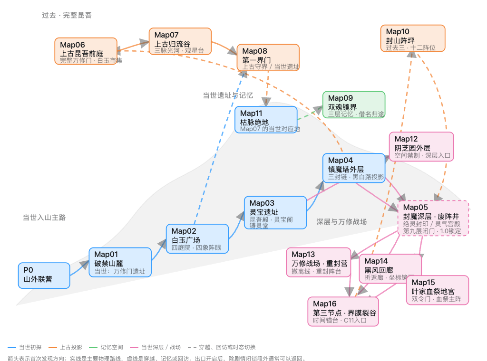

# 昆吾山全局路线图

这是项目 16 张稳定大地图的路线拓扑图，用于剧情、地图网络和关卡评审，不是 Godot 运行时地图数据。

文件：

- `kunwu_all_map_routes.png`：静态预览图。
- `kunwu_all_map_routes.html`：可切换“1.0／因果回溯／万修战场”视图的可编辑源稿。

路线口径来自：

- `Docs/1.0策划案/地图/27_完整游戏野外大地图与内容框架_草案.md`
- `Docs/1.0策划案/地图/28_地图01_破禁山麓与万修之门_详细设计_草案.md`
- `Docs/1.0策划案/剧情/20_1.0剧情任务详细剧本_草案.md`
- `Docs/1.0策划案/剧情/24_完整游戏剧情总纲_草案.md`

注意：`Map01` 的当世区域是万修门遗址，完整万修门只出现在上古 `Map06`；这张图不改变
`data/maps/`、`scenes/maps/` 或任何运行时碰撞、对象坐标和出口条件。
