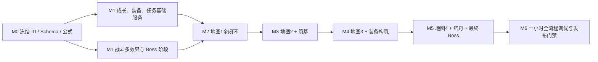

# 《昆吾禁地》1.0 内容依赖与验收矩阵（草案）

版本：1.0-draft.12  
日期：2026-08-06  
状态：用于策划评审与实施拆分，不直接覆盖现有 PRD

## 1. 文档事实源边界

| 内容 | 本草案组内事实源 |
|---|---|
| 版本范围、十小时节奏、地图与职业摘要 | `15_1.0版本完整策划案_草案.md` |
| 灵根倍率、等级花费、突破材料、七维、HP 与战斗公式 | `数值/16_1.0成长经济与战斗数值_草案.md` |
| 技能的伤害、冷却、状态与 AI | `数值/17_1.0职业技能数值_草案.md` |
| 装备品质、器纹七维、特定效果与掉落 | `数值/18_1.0装备与掉落数值_草案.md` |
| 炼器坊24级、蓝图、铁胚、器纹、工具与探索强化 | `数值/33_炼器坊升级与炼制机制_草案.md` |
| 基础材料名称、分类、加工关系与产出—消耗循环 | `数值/34_1.0基础材料与资源循环_草案.md` |
| 敌人、精英、Boss 属性和阶段机制 | `数值/19_1.0敌人与Boss战斗数值_草案.md` |
| 主线与支线 NPC、对话、选项、旗标、奖励和汇流 | `剧情/20_1.0剧情任务详细剧本_草案.md` |
| 完整地图网络、前四图空间、路线、内容投放与回访 | `地图/27_完整游戏野外大地图与内容框架_草案.md`、`地图/28`–`31`详细地图文档 |
| 旧版坐标、固定对象与首次奖励迁移参考 | `地图/22_1.0四图固定对象与经济清单_草案.md`；冲突以`27`–`31`为准 |
| 1.0两座主动资源副本、后续新修士追赶与长期Boss阵容克制 | `地图/32_可重复资源副本与新修士追赶机制_草案.md` |
| 偶数序位Boss魂魄、乌婆交付与确定性魂器 | `剧情/35_乌婆Boss魂魄与魂器馈赠机制_草案.md` |
| 交易行、灵源院、百宝库、还魂殿、扎营失败与野外刷新 | `数值/36_营地后勤与野外循环机制_草案.md` |
| 招贤馆1.0边界与后续随机修士方向 | `15_1.0版本完整策划案_草案.md` §4.7；1.0只解锁建筑 |

冲突解决顺序为：用户新确认 > 对应详细分册 > 总案摘要。评审通过前不将草案数值直接视为现有实现值。

## 2. 1.0 实施基线与必要扩展

| 领域 | 现有基线 | 1.0 必须扩展 | 不可退让的边界 |
|---|---|---|---|
| 修士成长 | `HeroInstance` 已保存灵根、等级、境界、职业、七维、HP 与阵亡状态 | 保存历史职业段、筑基技能组、技能熟练境界和自动策略，支持炼气→筑基分支→结丹精通 | 灵根同时缩放初始七维与升级成长；筑基后技能 ID 与机制锁定；结丹只增强数值；旧等级不能被当前职业成长率倒算 |
| 招贤馆 | 现有入口仅有锁定占位 | 解锁营地建筑与“后续版本开放”说明 | 1.0不建立候选、刷新、招募、改名、遣散、馆级、名册容量或随机修士实例 |
| 战斗 | 单目标、单状态和基础伤害已有 | 多目标、同技能多效果、独立 DoT 回合、群体/单体恢复、自吸血、嘲讽、按实际承伤反伤、临时生命、限时召唤物、减速、眩晕、飞行标签、Boss 阶段 | 1.0 无战斗净化；仍保持 `CombatCommand → 结算器 → CombatEvent → 表现层` |
| 地图 | D0 单图小范围、固定对象和探索存档已有 | 四个 bundle、异形可行走蒙版、碰撞/遮挡多边形、锁/短捷径、普通对象按新出征刷新、副本层、地图条件显示 | 已探索迷雾和永久对象状态不重置；领域层只使用 `GridCoord`；像素换算和遮挡淡化留在表现层 |
| 任务 | 仅有 `storyFlags: Record<string, boolean>` | 任务实例、当前节点、枚举/计数变量、可见目标、奖励领取幂等 | 选项只能调用任务命令，对话 UI 不直接改背包、地图或战斗真相 |
| 装备 | 背包只是物品计数 | 实例化装备、六档品质、蓝图、铁胚、1/2器纹槽、附着器纹、模板固定属性、特定效果、四槽位、职业限制、重复打造与配装对比 | 七维只来自器纹；器纹永久固定；槽数只由蓝图决定；古宝固定且不可打造；两饰品不允许同 ID |
| 经济与后勤 | 基础资源钱包和建筑入口已有 | 交易行常备/随机栏、灵源院岗位与离线生产、百宝库分类与待处理区、还魂殿、炼器坊1–24级及基础材料表 | 交易行只买不卖且只卖装备蓝图；五种生产资源独立储量；阵亡不永久删除修士；主线材料不得进入损失或分解路径 |
| 资源副本 | 无正式系统 | `map_03`回火矿窟、`map_04`镇魂残响、三个永久难度、首清捷径、快速重返、重复结算和失败恢复 | 可选主动挑战；无每日/体力/门票/扫荡；不挑战仍可通关主线 |
| 乌婆魂器 | 乌婆只有引魂剧情交互 | 第2、4个主线Boss首杀魂魄、保护物品、乌婆常驻交付、两件固定魂器与旧档补发 | 最低上品；直接发完整装备；不按地图编号或实际击杀顺序计数；不可成为主线装备硬门槛 |
| 存档 | Schema v8 已有主档、备份与迁移 | 新 Schema 保存任务、职业历史、装备实例、Boss 阶段外的持久结果、交易行批次、灵源院离线时间、待处理事务和结局记录 | 重要命令原子保存；迁移只追加，不修改历史迁移 |

1.0不新增队伍挂机派遣、离线战斗收益或对应存档字段。`map_03`、`map_04`两座主动资源副本
正式进入1.0配置、挑战命令、结算事务、存档和验收；两者均不成为主线资源或阵容门槛。

## 3. 建议数据资产与稳定 ID

### 3.1 数据表清单

| 数据集 | 核心字段 | 条数/覆盖 | 来源分册 |
|---|---|---:|---|
| `spiritual_root_multipliers_01` | `spiritual_root_id, base_percent, growth_percent` | 6 | 16 |
| `level_costs` | `from_level, to_level, soul_crystal, cumulative` | 29 | 16 |
| `breakthroughs` | `career_path_id, realm_id, level, wallet_costs, item_costs, trial_id, stat_bonus` | 16（8 筑基+8 结丹） | 16 |
| `career_growth_segments` | `career_id, min_level, max_level, growth_milli[7]` | 20 | 16 |
| `skills_01` | `skill_id, target, damage_kind, interval, cooldown, base_scaling[], mastery_scaling[], effects[], ai_tags` | 36（炼气过渡 12 + 筑基锁定 24） | 17 |
| `forge_levels_01` | `level, wood_cost, auto_unlock_recipe_ids[]` | 1–24 | 33 |
| `equipment_quality_rules_01` | `quality, color, budget_rule, craftable, ordinary_drop_allowed` | 6 | 18、33 |
| `materials_01` | `material_id, category, storage_kind, purchasable, sellable, protected, source_tags[], sink_tags[]` | 34定义的货币、生产资源、野外材料与加工品；1.0全部`sellable=false` | 34、36 |
| `resource_packages_01` | `item_id, resource_id, package_grade, fixed_yield, weight, source_tags[]` | 5类资源×4档，共20种 | 34 |
| `field_foods_01` | `item_id, display_name, grain_yield, weight, source_tags[]` | 按1.0地图主题内容表 | 34、地图28–31 |
| `equipment_blanks_01` | `quality, material_costs, wallet_costs, budget_rule` | 凡品至法宝5档 | 33、34 |
| `equipment_runes_01` | `stat_key, random_weight, recipe_id, external_sources[]` | 冻结七维7类 | 18、33 |
| `equipment_templates_01` | `template_id, slot, allowed_careers, allowed_stats[], rune_slots, base_stat_budget, fixed_secondary, weakened_stats, visuals` | 制式模板组+特定装备定义 | 18、33 |
| `equipment_specials_01` | `item_id, fixed_quality, base_stat_budget, fixed_effects[], stat_pool_override, unique_group` | 按分册特定装备表，含2件乌婆魂器 | 18、35 |
| `equipment_loot_tables_01` | `source_kind, map_id, equipment_chance, quality_weights, template_pool[]` | 四图普通/精英/Boss/宝箱 | 18 |
| `recipes_01` | `recipe_id, output_kind, template_or_item, forge_unlock_level, unlock_flag, wallet_costs, item_costs` | 铁胚、器纹、装备、工具、探索强化及突破材料 | 16、18、33、34 |
| `expedition_craft_upgrades_01` | `upgrade_id, stage, recipe_id, rest_bonus, vision_bonus` | 行营阵盘3阶、探灵灯3阶 | 33 |
| `enemies_01` | `enemy_id, level, race_tags, hp, stats[7], skill_ids, loot_table, main_boss_ordinal?` | 34 个模板 | 19、35 |
| `encounters_01` | `encounter_id, members[], formation, reward, escape_rule` | 按地图28–31职责与新版固定对象清单建立 | 19、地图28–31 |
| `quests_01` | `quest_id, start_condition, nodes[], terminal_states, rewards` | 6 条任务链（1主线＋5支线） | 20 |
| `dialogues_01` | `dialogue_id, speaker_id, text_key, choices[], next` | 逐场景拆分 | 20 |
| `maps_01` | `map_id, bounds, walkable_mask, collision_mask, occluders[], entry, terrain, objects[], exits[]` | 4 | 地图27–31、新版固定对象清单 |
| `repeatable_dungeons_01` | `dungeon_id, parent_map_id, unlock_condition, shortcut_id, reward_kind, difficulty_ids[]` | 2 | 32、地图30–31 |
| `dungeon_difficulties_01` | `difficulty_id, dungeon_id, realm_band, recommended_power, encounter_ids[], first_reward, repeat_reward` | 两座副本各3档，共6档 | 16、19、32 |
| `boss_soul_exchanges_01` | `exchange_id, main_boss_ordinal, soul_item_id, equipment_id, reward_claim_id, unlock_rule` | 1.0共2条 | 20、35 |
| `trading_house_goods_01` | `goods_id, pool_kind, unlock_progress, item_or_blueprint_id, stock, weight, price, resource_stage` | 常备栏商品＋6格随机栏商品池 | 34、36；地图22仅作旧版迁移参考 |
| `lingpu_jobs_01` | `job_id, resource_id, unlock_progress, grain_maintenance, output_per_cycle` | 灵粮、灵木、玄铁、灵晶、庚精5个岗位 | 34、36 |
| `time_dew_levels_01` | `level, cycle_seconds, unlock_quest_node` | 1.0只配置0–2（30/25/20秒）；3–4留在后续策划，不进入本资产 | 20、36 |
| `storage_rules_01` | `storage_kind, capacity_kind, stack_rule, overflow_rule, protected` | 公共钱包、五种资源、装备、堆叠物、任务保护区、待处理区 | 34、36 |

此处数量是制作预算，不是要求将所有数据塞进单个 JSON。实施时应按 bundle 和引用关系拆分，并由 Schema 做跨表引用校验。

### 3.2 稳定 ID 命名

| 类型 | 格式 | 例子 |
|---|---|---|
| 主线链/节点 | `mq_kunwu_01` / `mq_01_m1_03` | `mq_01_m4_07` |
| 支线链/节点 | `sq_01_ledger` / `sq_01_q1_03` | `sq_04_q4_04` |
| 对话 | `dlg_<quest>_<scene>_<serial>` | `dlg_mq_m2_05_03` |
| 地图对象 | `<map_id>.<kind>_<serial>` | `map_03.elite_04` |
| 遭遇 | `enc_<map>_<role>_<serial>` | `enc_m4_boss_01` |
| 敌人/技能 | `enemy_<name>` / `skill_<line>_<name>` | `enemy_silver_wing_avatar` |
| 制式模板/特装/配方 | `eqtpl_<slot>_<name>` / 保留既有特装 ID / `rcp_<output_id>` | `eqtpl_armor_light` / `r04_space_bead` / `rcp_dustfall_pill` |
| 突破道具 | `item_breakthrough_<name>` | `item_breakthrough_dustfall_pill`（降尘丹） |
| 资源包 | `item_resource_pack_<resource>_<grade>` | `item_resource_pack_wood_low` |
| 野外食物 | `item_field_food_<name>` | `item_field_food_fasting_cake`（辟谷饼） |
| Boss魂魄/乌婆兑换 | `item_boss_soul_<ordinal>_<boss>` / `wupo_boss_soul_<ordinal>` | `item_boss_soul_02_corpse_general` / `wupo_boss_soul_02` |
| 故事旗标 | `<scope>_<fact>` | `mq_ye_evidence`, `sq3_tablet_returned` |
| 固定修士模板/实例 | `hero_tpl_<career>_<serial>` / `hero_fixed_<name>` | `hero_tpl_five_elements_01` |
| 资源副本/难度 | `rd_<map>_<name>` / `<dungeon_id>_<realm>` | `rd_map03_refire_mine` / `rd_map03_refire_mine_foundation` |

所有 ID 使用英文小写蛇形，不用中文显示名做逻辑判断。授权名和原创替代名只替换本地化键的文本，不替换存档 ID。
玩家始终使用稳定 ID `player_seal_bearer`；对话框显示存档中的现用名。现用名不是旧姓名线索，改名不会改变
`identity_clues`、继任权限或任何任务判断。

## 4. 任务状态机与命令

### 4.1 节点状态

`LOCKED → AVAILABLE → ACTIVE → READY_TO_TURN_IN → COMPLETED`；只有被剧本明确放弃的子分支进入 `FAILED`。
主线不能进入无恢复路径的 `FAILED`。任务奖励使用 `reward_claim_id`幂等发放，重连或重复点击不重复给予。

### 4.2 可执行命令

| 命令 | 校验 | 原子结果 |
|---|---|---|
| `StartQuest` | 前置 Flag、地图解锁、未已完成 | 任务实例进入 ACTIVE |
| `ChooseDialogueOption` | 对话和选项可见、代价足够 | 扣除代价、写变量、推进节点 |
| `InteractMapObject` | 对象状态、道具、七维、任务节点 | 消耗/奖励、对象状态、事件全部同步落档 |
| `CompleteEncounter` | 战斗结果与 encounter ID 匹配 | 结算魂晶/掉落、对象、任务计数 |
| `ClaimQuestReward` | 节点完成且 claim ID 未使用 | 发放后标记幂等键；盗天灵液奖励先按旧周期结算，再原子写新等级、claim和生产锚点 |
| `PerformBreakthrough` | 等级、试炼、路线、灵石和对应境界道具满足；筑基 `item_costs` 为空 | 扣除全部成本、追加 career segment、发放属性 |
| `ResetSpecialization` | 已筑基、位于营地、存活、未被战斗/出征/任务占用且灵石足够 | 扣除灵石，替换Lv11后路线成长段、结丹称号/属性和技能组，按旧生命比例更新当前生命 |
| `RefreshTradingHouse` | 位于营地、交易行已解锁；手动刷新时灵石足够 | 自然或手动生成新批次并补满常备栏；手动刷新不修改下次自然刷新时间 |
| `PurchaseTradingHouseGood` | 商品仍在当前批次、库存与灵石足够；蓝图未拥有 | 原子扣除灵石和库存，发放物品或永久蓝图；不建立出售或回购记录 |
| `RecruitWorker` | 位于灵源院、灵粮足够、杂役人数未达上限 | 原子扣除灵粮并增加无品质、无属性的杂役人口 |
| `AssignLingpuWorkers` | 位于灵源院、岗位已解锁、分配总数合法 | 原子替换岗位分配并从下一结算周期生效；灵粮不足的非灵粮岗位自动暂停 |
| `ReviveHero` | 修士处于还魂殿；魂晶足够，或满足无存活修士保底 | 扣除魂晶或使用保底，恢复可编队状态；保留全部成长和装备 |
| `UpgradeForge` | 当前坊级<24、灵木足够 | 原子扣除灵木、提高坊级并解锁该级制式蓝图 |
| `CraftItem` | 配方已解锁、材料和道具容量满足 | 原子扣除材料，固定产出铁胚、器纹、归营符、开山镐或突破材料；随机器纹在产出时定型 |
| `CraftEquipment` | 蓝图、铁胚、1/2枚合法器纹、特装材料和背包容量满足 | 原子消耗材料，按铁胚定品质并把器纹永久写入新装备实例 |
| `DisassembleEquipment` | 位于百宝库；装备未穿戴、未锁定、非任务保护且非古宝 | 原子删除实例并发放分解材料；不生成出售或回购记录 |
| `ResolvePendingLoot` | 当前存在未完成结算，目标仓位足够或选择现场分解 | 领取或分解当前待处理奖励；全部处理前禁止再次出征 |
| `CraftExpeditionUpgrade` | 对应蓝图已解锁、前一阶完成、材料足够、本阶未完成 | 原子扣除材料并永久提高行营阵盘或探灵灯等级，从下一次启程生效 |
| `OpenResourcePackage` | 位于营地、资源包数量足够；生产资源完整产量不超过对应储量上限 | 原子消耗指定数量资源包并增加固定资源；批量打开只处理完整可容纳数量 |
| `ConsumeFieldFood` | 食物存在；野外仅限扎营，营地需有足够灵粮储量空间 | 原子消耗1件食物并向本次出征或公共灵粮增加固定`grain_yield` |
| `PerformRestHealing` | 正处于扎营状态、本次扎营尚未疗伤 | 不消耗任何道具或资源，按配置恢复所有存活修士并记录本次已疗伤；阵亡修士不复活 |
| `EnterRepeatableDungeon` | 副本已发现、难度已解锁、队伍合法且无其他活动入山 | 创建资源副本挑战快照并进入整备区；失败不扣未确认资源 |
| `CompleteRepeatableDungeon` | 挑战快照、难度和遭遇结果一致，结算键未使用 | 原子发放首次/重复奖励、记录首清与捷径并清除挑战快照 |
| `OfferBossSoulToWuPo` | 乌婆魂魄馈赠已开放、魂魄与兑换匹配、claim未使用、当前无冲突事务 | 原子消耗魂魄，生成固定魂器或写入待处理区，记录claim并刷新乌婆状态 |

### 4.3 变量类型

- 布尔 Flag：是否取得证据、是否修复枢纽、NPC 是否存活、玩家身份是否揭晓。
- 枚举：元牌归属、五鬼袋处理、叶观衡结局、封链方案、玩家对旧身份的记录选择、`timeless_tree_state`。
- 整数：`cen_trust`、`mu_trust`、`ye_evidence`、`seal_integrity`、`demonic_taint`、只增不减的`identity_clues`阶段、
  `time_dew_level`（1.0为0…2）、已修复枢纽数、已完成遗愿数。
- 集合：已读碑文、已获得阵图片、已击败的五鬼成员、已触发结丹对话的修士、已完成的乌婆Boss魂魄馈赠、
  `time_dew_claims`。

`storyFlags: Record<string, boolean>` 无法安全表示后三类，实施时应建独立 `QuestState`，不用多个布尔键拼出整数和枚举。

## 5. 页面与信息反馈最小集

| 页面/组件 | 必须展示 | 关键交互 |
|---|---|---|
| 任务追踪条 | 当前目标、距离/地图、条件进度 | 点击打开详情；不强制自动寻路 |
| 身份档案 | 现用名、掌印权限、已获得身份线索、已确认事实与未解疑点 | “总印为何认我”常驻为长期问题；地图4揭晓后分开显示已回答/未回答内容 |
| 对话面板 | 立绘、说话人、全文、选项、代价/检定、不可逆标识 | 不可逆选项二次确认；检定前显示属性与阈值 |
| 修士详情 | 七维、HP、灵根、境界、职业路径、3 技能、熟练境界和自动策略 | 筑基预览显示两分支定位、成长与技能组；结丹预览只显示同技能的`【精通】`数值增量 |
| 招贤馆 | 建筑名称、已解锁状态和“后续版本开放”说明 | 仅查看与关闭；不显示候选、倒计时、馆级或招募按钮 |
| 交易行 | 常备栏、6格随机栏、当前库存、价格、自然刷新倒计时、最高地图进度解锁提示 | 购买与灵石手动整批刷新；不出现出售、回购或装备成品 |
| 灵源院 | 五种岗位、杂役总数与分配、当前周期、盗天灵液等级、当前产量/维护、储量、离线结算、岗位暂停原因 | 只在本页招募和展示杂役；调整岗位与升级五种独立储量；灵液由任务奖励原子升级 |
| 突破面板 | 等级门槛、试炼、灵石、结丹所需降尘丹和突破后七维 | 降尘丹不足可直接跳转炼器坊配方；筑基不显示材料栏 |
| 装备面板 | 四槽、品质、附着器纹、最终七维、模板固定属性、固定特效、职业限制、来源 | 换装前后对比；不允许相同饰品重复装备；不显示装备等级；器纹不可拆卸或替换 |
| 百宝库 | 装备仓位、堆叠物分类、任务保护区、蓝图库入口、资源包准确产量、当前余额/上限 | 锁定、筛选、排序、批量分解与开包；满仓打造被拒绝，待处理区未清时不能再次出征 |
| 还魂殿 | 阵亡修士、保留成长与装备、魂晶费用、无存活修士保底 | 固定成功还魂；阵亡装备可卸下，不显示倒计时或付费加速 |
| 入山整备 | 队员、灵息、灵粮、负重、地图建议战力/境界 | 出发前警告灵粮不足、死亡队员、结丹门槛 |
| 野外扎营 | 剩余休整、当前灵粮、可用主题食物、存活修士生命、预计恢复量和本次疗伤状态 | 食物只补灵粮；每次扎营可免费运功疗伤1次，执行后置灰且不消耗物品 |
| 资源副本选择 | 已发现副本、永久难度、主产出、建议境界/战力、首清/重复状态 | 从地图入口或首清后的营地快捷入口进入；允许连续挑战和返回整备 |
| 乌婆魂魄馈赠 | 可交付魂魄、Boss来源、馈赠装备、品质、器纹、固定效果、是否已领取 | 从人物列表进入；确认后原子交付，已领取只可回看 |
| 探索 HUD | 灵粮、灵息、临时战利品、任务目标、目标对象图标 | 可随时查看已打开短捷径与安全归营路线 |
| 战斗 HUD | 行动条、状态图标层数/时长、Boss 阶段条件、敌人飞行/魔性等标签 | 手动技能目标、自动策略切换、暂停查看机制 |
| 失败报告 | 阵亡原因、受伤占比、被控时长、中断次数、推荐调整 | 一键回到配装/技能策略；明示本次丢失 |

竖屏布局一律以 `375×817` 为唯一玩家可见设计基准。

## 6. 存档、失败与防卡死

### 6.1 存档必须保存

1. 固定修士当前数值、形象模板、历史成长段、转职选择、锁定的筑基技能 ID、
   `skillProficiency`、累计升级魂晶、历次突破道具成本和自动策略。
2. 炼器坊等级、装备实例、蓝图、铁胚、器纹、最终七维、穿戴关系、配方解锁、特装任务进度、
   行营阵盘和探灵灯永久等级。
3. 任务节点、布尔/枚举/整数/集合变量、奖励幂等键；包括玩家现用名、`identity_clues`、
   `identity_revealed`和`identity_record_choice`。
4. 每图探索格、一次对象、短捷径、普通对象出征刷新批次、副本进度、Boss首杀、Boss魂魄持有状态、
   `wupo_soul_service_available`与`wupoBossSoulClaims`。
5. 交易行当前自然批次、常备/随机栏商品与库存、下次自然刷新时间；不保存出售或回购队列。
6. 招贤馆建筑解锁Flag；不保存馆级、候选批次、刷新时间、名册容量或随机修士状态。
7. 两座资源副本的发现、各难度首清、永久捷径、最近挑战设置和进行中挑战快照；不保存按现实时间增长的收益。
8. 灵源院杂役人口、岗位分配、五种储量等级与余额、上次生产结算时间、`time_dew_level`、
   `time_dew_claims`和`timeless_tree_state`；离线只补生产资源。
9. 百宝库装备与堆叠物、任务保护区、待处理事务，以及野外临时战利品中的资源包和主题食物；
   资源包未打开前不得提前写入公共余额。
10. 修士阵亡/还魂状态；还魂后不重建或丢失成长、装备与职业历史。

### 6.2 原子存档点

- 对话不可逆选项确认后。
- 完成战斗结算、开宝箱、交任务、领取盗天灵液、交易行购买/刷新、灵源院招募/分配、炼器坊升级、打造、分解、
  待处理领取、还魂、永久探索强化、突破和装备更换后。
- 招贤馆建筑解锁后。
- 开启/关闭短捷径、进出副本、安全归营后。
- 资源副本首清、重复结算、连续挑战或退出整备区后。
- 偶数序位Boss首杀魂魄生成、乌婆交付和魂器进入仓库或待处理区后。
- Boss 战内不保存阶段 HP；异常退出后回到战前存档，不复制消耗品也不保留战斗奖励。

### 6.3 必须通过的死锁用例

| 情形 | 恢复规则 |
|---|---|
| 全队阵亡时持有主线突破材料 | 任务物、突破材料和唯一关键物不进入临时战利品损失池，原样保留 |
| 误操作关键材料 | 交易行不提供出售；任务物、突破材料和唯一关键物禁止分解或丢弃 |
| 魂晶花空、无法达成结丹门槛 | 固定副本和未清支线提供足量差额；若全清仍不足，开启无战力门槛的营地委托 |
| 全部修士阵亡且魂晶不足 | 允许免费还魂一名固定修士；装备仍可在营地卸下 |
| 选择魔道支线后污染过高 | 改变结局与部分 Boss 机制，但不封死主线入口 |
| 缺少支线证据 | 降低可选对话/结局评价，不阻断地图 4 Boss |
| 灵粮断绝时站在封闭副本 | 保留“立即弃山”命令，按阵亡损失结算并回营 |

## 7. 制作依赖与里程碑

| 里程碑 | 完成定义 |
|---|---|
| M0 内容冻结 | 本草案组通过评审；同名、同 ID、同数值的跨表引用无冲突 |
| M1 横向系统 | 固定四人可升级、筑基转职、结丹精通和换装；交易行、灵源院、百宝库、还魂殿形成营地后勤闭环；招贤馆建筑可解锁但无招募交互；36 个技能及基础/精通两档数值都能由领域层表达 |
| M2 地图 1 | 从新档到石灵首杀可完成，返回营地后奖励、旗标和短捷径正确 |
| M3 地图 2 | 四人可走任一筑基分支；尸将与支线汇流可分别通过；封坛尸将魂魄可交乌婆换取上品封坛军魂甲 |
| M4 地图 3 | 多部位 Boss、珍品任务链、随机制式装备和两条中后期支线不互锁；回火矿窟可首清并重复挑战 |
| M5 地图 4 | 四人全员结丹是最终 Boss 的硬门槛；三种结局评价均可到达；镇魂残响可首清并重复挑战；银翅魂魄可换珍品银翅魂衣 |
| M6 发布候选 | 首通中位数 9–11 小时；无主线死锁；断网可全程玩；存档可恢复 |

## 8. 内容与系统验收矩阵

| 用户要求 | 可交付证据 | 可量化验收 |
|---|---|---|
| 约 10 小时 | 总案时间表、魂晶投放、地图固定对象 | 首次玩、阅读大部分对话且完成 2–5 支线的 P50 为 9–11 小时，P90 不超过 14 小时 |
| 4 张大地图 | 15、22 | 每图有唯一风格、尺寸、主环/支路、敌群、资源、事件、副本、Boss 和回访点 |
| 4 职业至结丹 | 15–17 | 四名固定修士均可 Lv1→30；Lv10 二选一筑基并锁定 3 个主动技能；Lv20 沿原支线结丹且技能 ID 不变，只进入`【精通】`数值 |
| 招贤馆建筑 | 15 | 1.0可解锁并显示后续开放说明；不生成候选、刷新计时、馆级、随机修士或相关经济消耗 |
| 营地后勤闭环 | 34、36 | 交易行只买蓝图与限量物品；灵源院自动离线生产五种资源；百宝库满仓不丢奖励；还魂不永久删角且存在最终保底 |
| 2座主动资源副本 | 16、32、地图30–31 | 回火矿窟主产灵石、镇魂残响主产魂晶；首清后可快速重返；无每日、体力、门票、扫荡或离线收益 |
| 明确升级与突破成本 | 16 | Lv1→30 共 29 个逐级魂晶成本；筑基仅灵石300，结丹为灵石1200与降尘丹1，七维收益无空值 |
| 精确技能与状态 | 17 | 36 个技能都能从表格唯一计算基础/精通两档的目标、伤害/治疗、冷却、状态强度和持续时间；任一分支始终恰有 3 个主动技能 |
| 器纹七维与高阶特装 | 18、33 | 非古宝七维只来自1/2枚器纹；铁胚决定凡品至法宝品质；特装蓝图不受坊级二次限制；古宝固定且不可打造 |
| 4 个 Boss，结丹才能通过第 4 个 | 19、20 | 每图恰 1 Boss；地图 4 入战时四人均需 `realm >= jiedan`，且结丹只提升既有技能数值；可根据阶段规则完整复现战斗 |
| 每2关Boss魂魄与乌婆魂器 | 18–20、35 | `mainBossOrdinal=2/4`各只掉落一枚受保护魂魄；交付后分别获得上品封坛军魂甲、珍品银翅魂衣，刷新和旧档迁移不复制 |
| 主线曲折、有 NPC/对话/选项/分支 | 20 | 30 个场景均有明确触发和台词/演出；“我是谁”在序章提出、前三图递进、地图4强制揭晓；有意义的冲突节点才给选项，关键证据不封死主线 |
| 5 条同等详细支线 | 20 | 每条至少 4 节点、一个可感知选择、一个主线汇流效果和确定性奖励；支线五选择不永久丢失灵液 |
| 地图资源和经济不卡死 | 16、18、27–36 | 随机装备不作为主线门槛；不等待交易行随机刷新也能凑齐突破材料和基础制造材料；任一主线物品都有恢复路径 |

## 9. 数值与剧情交叉审计清单

实施前逐项勾选：

- [ ] 四人从 Lv1 逐级累加到 Lv30 的七维与 16 的检查点一致。
- [ ] 36 个技能的属性键、目标类型、状态 ID 存在；各筑基分支恰有 3 技能，结丹前后 `skill_id` 完全不变。
- [ ] 所有战斗减益均可自然结束或通过抵抗、恢复、护盾与机制打断应对，不存在战斗净化硬检查。
- [ ] 四图 `walkable_mask` 均形成异形轮廓；遮挡物有碰撞多边形、排序层和淡入淡出参数，不改变领域层格坐标。
- [ ] 炼器坊可从1级连续升至24级，升级只扣灵木；每级严格按33分册的24级表解锁且保存幂等。
- [ ] 凡品至法宝由对应铁胚确定品质；不存在古宝铁胚或古宝打造配方。
- [ ] 制式装备七维只来自1/2枚器纹；武器/饰品、玄甲、法衣、行衣分别满足允许池与削弱规则。
- [ ] 器纹槽数只由蓝图决定；双器纹允许同七维，器纹写入后不能拆卸、替换或重抽。
- [ ] 五种通用饰品模板固定提供命中、闪避、暴击、治疗和状态抵抗，且这些属性不进入器纹池。
- [ ] 26 个旧普通装备 ID 只注册为制式模板，§5 特定装备 ID 只注册为特装定义；两池不重叠。
- [ ] 特定装备 ID、固定品质、基础预算、固定效果、任务来源与器纹池覆盖均可解析；所有装备表、
  实例、UI与存档均无装备等级字段；古宝只能由显式特殊来源直接发放固定实例。
- [ ] 固定敌群只引用 19 定义的敌人模板，首次奖励与掉落表不重复发放。
- [ ] 四个主线Boss的`mainBossOrdinal`为1–4且唯一；只有2、4配置魂魄和乌婆兑换，资源副本精英不参与计数。
- [ ] 封坛军魂甲与银翅魂衣的品质、固定器纹、固定效果和来源可解析；仓库满时进入待处理区，
  交付失败返还魂魄，重复请求不复制装备。
- [ ] 主支线所有 NPC、地图对象、道具、敌人和奖励 ID 可解析。
- [ ] 不做任何支线也会在地图4明确揭示玩家的旧队身份、幸存原因和营主权限来源；旧姓名与是否自愿被清楚列为后续疑点。
- [ ] 每个不可逆选择的后果在后续至少有一次可感知反馈，而非只写 Flag。
- [ ] 地图2固定提供四人筑基所需灵石1200；炼器坊3级解锁降尘丹配方，地图3提供四枚所需的凝丹灵草4、灵晶60和结丹灵石4800。
- [ ] 行营阵盘三阶把下次启程休整上限从1次提高到最多4次；探灵灯完成三阶后累计永久扩大3次
  探查范围，具体格数只读取数值配置。
- [ ] 照影石可从野外矿点与交易行获得；引灵砂可稳定支持归营符制造；进行中的出征不被永久升级改写。
- [ ] 开山镐在启程成功时转为本次出征有效状态，归营或阵亡后失效，地图对象不再逐次扣镐。
- [ ] 最差合理路线（检定失败、不接可选奖励）仍能全员结丹并进入最终战。
- [ ] 最佳路线的额外奖励不会使最终 Boss 跳过核心阶段。
- [ ] 新档、地图内强退、战斗中强退、任务奖励时强退、旧存档迁移均有验收用例。
- [ ] 四人不同筑基组合至少覆盖 16 种，必须不存在唯一正解队伍。
- [ ] 高成本专精重置只在营地执行，固定成功且不免费治疗；失败完整回滚，重置后裸装七维与目标
  路线从Lv11成长至当前等级的结果完全一致。
- [ ] 完全不挑战资源副本时，固定四人任一合理筑基组合仍可完成全部主线；前四章没有第五、第六人。
- [ ] 两座资源副本的发现、首清、重复奖励、快速重返和连续挑战均可恢复；重复挑战不推进主线或复制唯一物。
- [ ] 招贤馆在1.0只有建筑解锁Flag和后续开放说明；Schema、页面、命令和经济表中不存在可执行的候选、刷新、招募、馆级或遣散功能。
- [ ] 交易行自然刷新每2小时离线计时，手动刷新只扣灵石且不改变自然倒计时；常备栏补满、
  随机栏严格6格，页面和数据均不存在出售、回购或装备成品。
- [ ] 灵源院是杂役招募、展示和岗位分配的唯一入口；五种岗位自动离线结算，满仓或灵粮不足时
  只暂停对应岗位，不产生负数或跨资源误停。
- [ ] 1.0盗天灵液只允许`time_dew_level=0→1→2`，周期固定为`30→25→20`秒；升级前按旧周期结算，
  重复claim、刷新、迁移或时间回拨不再次升级，C07/C09的15/10秒档位在1.0不可达。
- [ ] 百宝库满仓时打造不扣材料；Boss、任务与归营奖励进入可恢复待处理事务，未处理完成不能
  再次出征，刷新或重复请求不复制装备。
- [ ] 固定与随机修士阵亡均进入还魂殿；单人阵亡不强制结束出征，扎营不能复活；无存活修士且
  魂晶不足时能够免费还魂一名固定修士。
- [ ] 全队阵亡只抽取本次出征临时战利品，装备、营地库存、公共资源、任务物和突破材料不进入损失池。
- [ ] 每次新出征只刷新普通敌群和普通资源点；迷雾、捷径、剧情、NPC生死、唯一宝箱、精英与
  Boss首杀永久保存，首次奖励不可重复领取。
- [ ] 五类资源各有下品、上品、特级、仙品四档资源包；开包固定产量、容量不足不损失、刷新或重复请求不复制资源。
- [ ] 辟谷饼、干粮和不同兽肉复用统一食物命令；扎营使用只补本次出征灵粮，回营使用只补公共灵粮。
- [ ] 每次扎营固定有1次免费运功疗伤，只恢复存活修士且不复活阵亡修士；不消耗草药、药品、
  食物、货币或其他材料，刷新和重复请求不能重复恢复。
- [ ] 凝露草只在明确剧情救治或净化节点直接提交，不存在凝露散或其他以其制作的玩家恢复品。

## 10. 发布验收数据

不需联网上报才能发布，但建议在 `telemetry_local` 保存匿名本地记录，供测试者自愿导出：

| 事件 | 最小字段 | 用途 |
|---|---|---|
| `map_enter/map_return` | `map_id, play_seconds, level_band, grain_in/out` | 校验时长与灵粮压力 |
| `combat_end` | `encounter_id, win, duration, deaths, escape, damage_summary` | 查找数值墙与机制不可读 |
| `quest_choice` | `node_id, choice_id, visible_conditions` | 检查分支可理解性，不记录个人信息 |
| `breakthrough` | `hero_id, path_id, level, play_seconds` | 验证四人结丹节奏 |
| `equipment_change` | `hero_id, slot, old_id, new_id, encounter_context` | 识别无人使用的装备和唯一解 |
| `boss_soul_exchange` | `exchange_id, boss_ordinal, equipment_id, seconds_after_boss` | 检查魂魄是否被理解、找到乌婆并正常领取，不用于限时或留存门槛 |
| `ending_reached` | `ending_id, play_seconds, side_quests, retries` | 验收十小时目标与结局分布 |

发布前至少完成 12 个全流程样本：4 个低练度、4 个熟悉同类游戏、4 个策划/开发人员。
不以开发者速通时长代替首玩时长。若 P50 超出 9–11 小时，优先调整路径、交互重复和战斗数量，而不是调高或调低魂晶增速来掩盖节奏问题。
