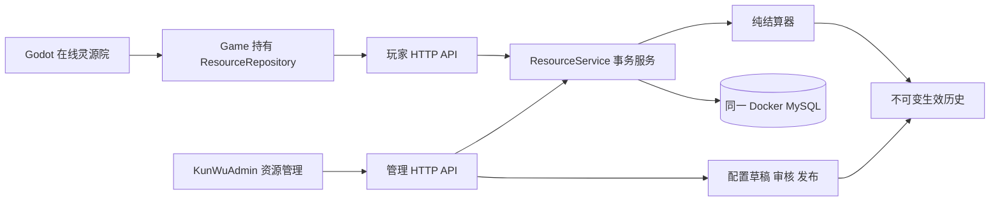

# 资源管理与灵源院前后端分离技术方案

版本：1.0（独立在线模块实装）

日期：2026-09-15

## 1. 范围与状态

依据 [已确认资源管理 PRD](../PRD/07_资源管理与灵源院前后端分离_PRD.md)、[灵源院页面 PRD](../PRD/03_灵源院与交易行_PRD.md) 和 [后勤规则](../1.0策划案/数值/36_营地后勤与野外循环机制_草案.md)。当前实现五类资源的独立在线闭环：配置、结算、库存、岗位、招募、储量、管理调整、流水、客户端同步与恢复。

本文件替代 0.1 的拟议表结构和路由名称，以本版实装清单为准。原 Godot 单机默认流程保持原状。正式账号/旧档迁移、探索/锻造等其他模块全面上云仍按 Q3/Q8 属后续上线集成，不自动合并本地与在线余额。

## 2. 实际架构



- 使用已有 KunWuAdmin Next.js/TypeScript/mysql2/Drizzle/MySQL，不增加微服务或 Redis。
- 管理和玩家接口共进程、身份和权限隔离；所有余额操作经同一资源服务。
- 结算器为纯函数，不读时钟、不访问数据库。模拟与实际生产复用该函数。
- Godot 只使用 GDScript/HTTPRequest，不增加 Node.js 运行时依赖；启动器读取相邻后台凭据仅用于开发联调。

### 2.1 相对 0.1 设计的实装调整

1. **聚合存储**：五余额、杂役和生产状态存入一个资源域 JSON 聚合，用玩家行锁保证一致性；不复制完整 Godot profile。流水、会话、请求与配置均独立表。暂不拆成余额/worker多表，以减少跨行中间态。
2. **模块发布**：新增资源域草稿/审核/发布历史，复用现有 Admin 应用与数据库；原六模块配置发布与 D0 数据不改。原因是当前 v1_0 全配置尚未填充，不能使独立资源模块被其他空模块阻塞。本域发布不等于发布完整游戏配置。
3. **管理预览**：界面显示权威版本、当前余额、目标余额与容量；提交这些值，锁内先结算再比对。没有新增预览 token 表，等效防止覆盖已变化余额。
4. **续算**：重复原 POST、相同 Idempotency-Key 和原 body 即可恢复；GET 请求查询只读。未新增单独 resume URL。
5. **账号**：提供受环境限制的独立开发会话，不宣称现有 Admin 用户表已经完成登录产品。正式账号适配继续作为上线集成项。

## 3. 代码入口

| 仓库 | 位置 | 职责 |
|---|---|---|
| Admin | `server/domain/resources/rules.ts` | 资源 code、v2规则、请求与跨字段校验 |
| Admin | `server/domain/resources/settle.ts` | 时间事件、有理进度、维护票据、纯领域命令 |
| Admin | `server/services/resource-service.ts` | 身份、事务、行锁、版本/请求幂等、账本、配置与领取去重 |
| Admin | `server/http/resource-http.ts` | 响应、错误、Origin、认证头/Cookie入口 |
| Admin | `db/schema/player-resources.ts` | 9张资源表 |
| Admin | `db/migrations/0002_parallel_morlocks.sql` | 自动生成的增量迁移，仅新增表与索引 |
| Admin | `app/api/game/v1/resources/[...action]/route.ts` | 玩家接口 |
| Admin | `app/api/admin/resources/[...action]/route.ts` | 管理接口 |
| Admin | `components/resource-management/`、`app/resources/` | 管理页面、模拟与独立 CSS |
| Admin | `tools/resource-development.ts` | 本机身份初始化/原身份续期，不输出令牌 |
| Godot | `scripts/services/resource_repository.gd` | HTTP、快照校验、离线状态和原请求恢复 |
| Godot | `scripts/scenes/resource_online_test.gd` | 五岗位、招募、升级、进度与结算提示 |
| Godot | `scripts/autoload/game.gd` 新增资源方法 | 持有服务节点、隔离测试缓存读写 |
| Godot | `run_resource_online_test.command`、`tools/run_resource_online_test.py` | 一键开发启动，凭据只通过环境变量传递 |

## 4. 数据模型

| 表 | 用途与约束 |
|---|---|
| `resource_player` | id、环境、标签、version、资源域state、pending、状态；id为主锁 |
| `resource_session` | tokenHash主键、actorId/kind、环境、权限、到期时间；明文不落库 |
| `resource_rule_draft` | 环境主键、revision、rules、status、approvedRevision；发布锁 |
| `resource_rule_release` | 不可变id、环境、生效毫秒、规则JSON、SHA-256、操作者；环境+时间唯一 |
| `resource_request` | 玩家+操作者+requestId唯一；payloadHash、响应与HTTP状态持久化 |
| `resource_transaction` | 玩家、操作者、请求、时间、业务类型和结算报告 |
| `resource_ledger` | 事务关联、资源、前后余额、净增减；同一数据库事务写入 |
| `resource_claim` | 玩家+claimId唯一；请求与payloadHash防止重复领取或换参数 |
| `resource_admin_audit` | 管理操作人、环境、时间、动作、原因与详情 |

金额用 BigInt 运算和十进制字符串传输；拒绝负数、非整数及超出有符号64位范围。时间为数据库 UTC 毫秒。个人进度为约分有理数，不将显示浮点写回服务器。workerId保持稳定，庚精保存个人0/1成功周期余数。

配置可选 `catalog` 保存五类资源的显示名、名称键、分类、稳定图标引用、存放位置、容量策略、启用状态及来源/用途引用；旧发布缺省时使用固定目录，不改写历史发布与哈希。已引用的五类资源禁止删除、改 code 或停用。目录编辑与数值配置共同经过草稿、校验、审核、发布，Godot 从已发布快照读取显示名。暂不纳入货币、装备等其他模块目录。

资源 code：spiritGrain、spiritWood、darkIron、spiritCrystal、gengJing。灵晶与旧 spiritStone（灵石）独立，不做旧余额改名迁移。

## 5. 结算与领域命令

### 5.1 时间推进

`settle(state, targetMs, initialRules, activations, budget)` 返回新状态、报告、complete及原目标时间，不改变输入。

- 按周期完成、规则生效与外部命令边界推进，最多12名杂役。
- 开始周期先检查容量，满仓/超容量冻结，无新维护、不积累隐藏进度。
- 非粮岗位按灵木→玄铁→灵晶→庚精供给；同一时刻同岗待开工人员必须能完整付费，否则该批暂停。
- 维护在开始周期扣除，ticket记录已支付状态。不能借本周期尚未产出的灵粮支付期初费用。
- 完成后入库可容纳数量，最后一个部分入库周期收完整维护、记录溢出；后续满仓停工。
- 已付维护的部分周期被外部变更变成满仓时，冻结进度与ticket，不回溯退费；有空间后恢复，不重复扣费。
- 查询恰好落在完成时刻，不提前支付下一周期费用。只有继续推进时间才开工下一周期。
- 已完成的庚精周期更新个人余数，两个成功周期才出产；缺粮、满仓和离岗不增加成功周期。

### 5.2 调岗、加速、招募与升级

`applyCommand` 实现 allocation/recruit/storage/dew/adjust；调用者必须先完成时间结算，并提供认证、版本与去重事务。

- 调岗保留未减少岗位人员，按workerId释放/补充人员；个人进度携带，空闲冻结。
- 非粮转非粮不重复支付当前维护，粮转非粮须付费再继续；非粮转粮不退费。切换不产生额外完成事件。
- 灵液保持未完成比例，庚精余数不变；任务奖励经受信任服务和唯一claim提交，不开放玩家任意发放接口。
- 招募按第7–12人费用计算，最多12人；新杂役零进度。
- 升级先结算旧容量，扣灵木再升级；不会补发历史溢出。

### 5.3 离线与配置边界

无独立离线时长上限。预算限制单次处理工作量，不能减少收益；未完成则持久化pending（原请求、固定目标、摘要），返回202。期间其他修改被拒绝，服务重启后仍可重复原请求继续。

全部停工且没有内部恢复事件时可直接跳到下一配置/目标边界。其余采用有界事件推进，不依赖每玩家常驻Timer。

生效时刻先完成旧周期，再应用新规则；进度比例与已支付票据保留。新配置不重算过去。历史规则读时校验哈希；缺失或损坏则停止，不拿最新规则代替。降容量保留库存并停工，消耗至上限以下恢复。

### 5.4 管理模拟与发布复核

模拟支持 10 分钟、1 小时、24 小时及自定义时长；可逐人输入周期完成百分比、庚精余数和维护是否已付。输入余额代表模拟起点的现存余额，历史已付维护不再次扣除。结果展示产出、维护、入库、溢出、余额与停工原因；超出计算预算明确报错，不冒充完整收益。

发布前展示草稿相对最近已发布版本的字段差异及受影响行为。历史版本可载入编辑区，重新保存、审核、发布，不能覆盖历史记录。生产周期、维护、岗位顺序与解锁条件遵守已确认 1.0 固定语义，界面可查，服务端禁止非法改动。

## 6. 数据库事务与幂等

```text
验证身份、环境和请求结构
BEGIN（READ COMMITTED）
  环境草稿行 FOR SHARE → 玩家行 FOR UPDATE
  查询 requestId；已完成同参数返回原结果，不再执行
  异参数同key拒绝；其他未完成请求返回PLAYER_BUSY
  首次命令校验expectedVersion
  锁后读取数据库时间，加载配置历史并结算
  未完成：写pending、部分状态/流水、202响应
  完成：执行命令，写状态/版本、流水/审计/领取与最终请求结果
COMMIT
```

普通玩家命令失败回滚整个新事务。死锁/锁等待允许最多两次同请求重试，不更换key。连接中断、未知提交结果由同key查询/重试解决。没有公开的直接改余额SQL接口。

管理员设置余额采用更严格规则：锁内先结算，比对提交的版本与原余额。若有变化，允许提交合法生产结算，返回409+新快照，调整本身不执行；用户刷新确认后生成新请求。合法调整与账本、管理审计原子提交；审计写入失败导致调整全部回滚。

无实质状态变化的时间推进不增加version；纯空闲同步不制造空生产流水。请求记录保留原结果；本期不自动清理去重键。

## 7. HTTP契约

全部响应禁止缓存。玩家Bearer会话；管理使用Bearer或HttpOnly/SameSite=Strict Cookie。环境从会话取，不由玩家body覆盖。修改请求使用 `Idempotency-Key`，查询失败不能随意更换原key。

| 方法与路径 | 输入/行为 |
|---|---|
| POST `/api/game/v1/resources/sync` | 结算同步；body无需玩家id |
| POST `/api/game/v1/resources/command` | type=allocation/recruit/storage，expectedVersion；分配含完整五岗位，升级含asset |
| GET `/api/game/v1/resources/requests/:id` | 只读自己的原请求结果 |
| POST `/api/admin/resources/local-login` | 仅显式开启且回环地址使用已有本机开发会话 |
| GET `/api/admin/resources/session` | 当前身份、环境、权限 |
| GET `/api/admin/resources/players` | 当前环境玩家列表 |
| POST `/api/admin/resources/players/:id/sync` | 权威余额预览；需原请求key |
| POST `/api/admin/resources/players/:id/adjust` | type/asset/mode/amount/expectedVersion/expectedBalance/reason |
| GET `/api/admin/resources/players/:id/ledger` | 当前环境最近资源流水 |
| GET/POST `/api/admin/resources/configuration` | 读草稿历史；save/approve/publish指定revision和原因 |
| POST `/api/admin/resources/simulate` | 使用当前已保存草稿，不入账 |
| POST `/api/resources/simulate` | 原独立固定基线模拟，不入账 |

成功返回schemaVersion、stateVersion、serverTimeMs、state、capacities、rulesSummary、settlement、complete。金额与version为字符串。202返回同一个请求号，客户端重复原POST继续。

错误区分401身份失效、403权限/环境、409状态/幂等/占用冲突、422业务余额/人数/容量、503规则/时间异常；返回中文信息，服务器不记录凭据。

## 8. 后台功能与发布

`/resources`有玩家资源、生产配置和模拟三个页签；原配置中心增加入口。

- 玩家页：查看五类余额/容量/等级/人数；增加、扣减、设置余额；原因必填；预览前后值；最近流水。
- 配置页：产量、五资源五级储量/费用、逐人招募费用。岗位身份、解锁、维护与周期保持冻结契约。
- 校验：code顺序、完整等级表、递增容量、升级费用可达、招募费用递增/可支付、合法金额、冻结解锁。
- 保存使审核失效；审核绑定当前revision；发布要求已审核且revision不变。不同权限分别控制编辑、审核、发布、查看与调账。
- 发布取得环境排他锁并在锁内取生效时间，玩家共享锁与之互斥；规则快照不可变。
- 回退可将历史规则保存为新草稿，重新审核发布；不编辑旧发布、不撤销已发生流水。本期页面展示历史id/时间，程序不自动回滚。
- 浏览器对余额未知结果保存pending，恢复时同key重试；禁用其他调整以防重复扣款。Cookie写请求比较实际Host构成的Origin，兼容localhost/127.0.0.1同时拦截跨站。

## 9. Godot接入

Game持有ResourceRepository，在线快照独立于profile.wallet。独立场景不调用旧生产/消费函数，原游戏场景仍保持单机默认。开发启动器始终带 `--no-profile-write --ignore-config-cache`。

Repository严格校验快照，用stateVersion、serverTimeMs过滤过期响应；HTTP超时保留endpoint/body/key，凭据只在内存。测试缓存通过Game写入 `user://resource_tests/<scope-hash>.json`，与原存档分离；缓存不包含令牌，按服务地址与身份摘要隔离。

在线面板显示五岗位、解锁、库存/容量、个人周期的显示进度、灵液周期、招募确认、储量升级确认、最近维护/入库/溢出。进度条仅视觉估算，不能加余额。请求在途禁用操作，断线只读；同步按钮恢复原操作，已连接时周期刷新。

## 10. 部署与运行

复用 Docker `kunwu-admin-mysql`，127.0.0.1:3307；新增迁移后68表（含Drizzle历史表）。

```bash
# 在 KunWuAdmin
pnpm db:up
pnpm db:migrate
pnpm resources:setup
pnpm resources:dev
```

生产构建的本机验收：`pnpm build` 后 `pnpm resources:start`。开发快捷登录开关仅用于本机回环服务，不用于公开部署。

`.local/resource-development.json` 被Git忽略、权限600。setup首次创建独立玩家/管理会话，后续为同身份续期7天，不改变已有权限。正式账号登录/注册与凭据存储另行接入；不把本机快捷登录暴露到公网。

Godot双击根目录 `run_resource_online_test.command`。启动器用Python读取开发凭据并通过环境传给Godot，参数/日志不带令牌；可用 `KUNWU_ADMIN_ROOT`、`KUNWU_RESOURCE_API_URL`、`GODOT_BIN`指定开发路径。Godot运行时只依赖服务HTTP，不读取后台源码。

本机有两套Node，需使用ARM版本匹配现有依赖：`/Users/zhangxiaoen/.nvm/versions/node/v22.22.2/bin/node`。x64 esbuild报错不需要重建MySQL。

## 11. 验证与后续集成

```bash
pnpm test:resources          # 30项领域及MySQL集成测试
pnpm test:resources:godot    # 先启动资源API；独立玩家和临时凭据
pnpm typecheck
pnpm lint
pnpm build
```

已验证：150组随机时间分段一致性；满仓/维护/调岗/庚精/加速；并发与幂等；失败及审计故障回滚；配置审核失效/不可变发布；会话/权限/环境；持久化续算恢复。Godot真实HTTP验证同步、分配、招募、升级、余额不足、断线和pending恢复，原存档哈希不变。浏览器验证余额加10再扣10、流水、同值基线保存审核发布、目录改名差异及恢复、个人进度输入和模拟结果。真实 HTTP 另验证身份/角色拒绝、同源登录保护和个人进度模拟。

在线 Godot 场景已实际启动且无脚本错误，最终布局仍需在标题“灵源院在线测试”的窗口人工复核；自动化界面工具目前绑定到原有编辑器嵌入窗口，该营地画面不能算在线页视觉验收。启动入口见第10节。

独立在线模块不表示其他玩法已全面服务器化。下一轮正式游戏接入必须审计所有五类资源来源和消费，走同一事务服务，任务奖励须有服务端可信依据；不能提供客户端任意addResource。正式账号、旧档合法迁移和跨玩法账本验收完成前，不替换默认单机入口。

续接状态见 [任务状态包](../Artifacts/resource-management/CONTEXT.md)。

## 12. 正式营地招募配置接入（2026-09-16）

正式营地招募已单独接入，其他余额来源/消费的在线迁移仍未完成。

- Admin新增 `GET /api/game-config/{development|staging|production}/recruitment`，读取数据库当前时间已生效的最近 `resource_rule_release`，验证历史规则哈希后只返回招募配置；不返回会话/玩家，不读取草稿。未发布404、损坏/不可用503，响应no-store。
- Godot新增 `scripts/services/recruitment_config.gd`，由Game持有；每30秒刷新；Game负责按地址/渠道隔离缓存。缓存和有效发布均不存在时禁用招募，不使用旧50回退值。
- `Game.recruitment_quote()`为界面和消费的唯一报价入口：逐人费用、每次1人、上限12。旧档超12人不裁减、不新增；旧档不足6人拒绝不完整映射。
- 确认请求携带完整报价（人数、价格、发布id）；实际扣款前重新报价并比较，防止弹窗旧价按新价扣除。资源仍从当前本地钱包扣除，不暗中写入在线测试玩家。
- 配置注入与真实HTTP验证覆盖显示/扣款一致、逐人递增、过期报价拒绝、余额不足、61人旧档保留和无配置不回退50。新后台构建通过，当前发布费用300/450/650/900/1200/1600。
